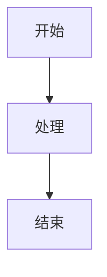

# 产品详细设计文档编写指南

## 概述

本指南基于 GitHub 上多个优秀开源项目的最佳实践，帮助你编写高质量的产品详细设计文档。

## 参考的优质项目

我们研究并综合了以下 GitHub 项目的精华：

### 核心参考项目

1. **[bflorat/architecture-document-template](https://github.com/bflorat/architecture-document-template)** ⭐ 276
   - 采用五视图架构（应用、安全、规模、基础设施、开发）
   - 结构清晰，适用性强
   - 适合各种架构风格（单体、微服务、SOA等）

2. **[jam01/SDD-Template](https://github.com/jam01/SDD-Template)** ⭐ 100+
   - 基于 IEEE 1016-2009 和 ISO/IEC/IEEE 42010 标准
   - 视角化的设计结构
   - 强调可追溯性和 AI 友好

3. **[shekhargulati/software-architecture-document-template](https://github.com/shekhargulati/software-architecture-document-template)** ⭐ 19
   - 简洁实用的模板
   - 关注利益相关者和质量属性
   - 包含容量规划和性能计算

4. **[wepay/design_doc_template](https://github.com/wepay/design_doc_template)**
   - 微服务架构设计文档
   - 来自 WePay 的实践经验
   - 适合云原生应用

### 其他有价值的项目

5. **[storj/roadmap - PRD Template](https://github.com/storj/roadmap/blob/main/Product%20Requirements%20Document%20Template)**
   - 产品需求文档模板
   - 适合产品经理使用

6. **[milanm/architecture-docs](https://github.com/milanm/architecture-docs)**
   - 使用 arc42 模板和 C4 模型
   - 自动化架构文档生成

7. **[joelparkerhenderson/architecture-decision-record](https://github.com/joelparkerhenderson/architecture-decision-record)**
   - 架构决策记录（ADR）示例
   - 记录重要的架构决策

## 编写原则

### 1. 保持简洁 (Keep It Simple)

> 来自 bflorat/architecture-document-template

- 每个字都要有意义
- 避免无用的介绍和重复
- 不要包含其他文档已有的内容
- 文档应该易于维护和更新

### 2. 视角分离 (Viewpoint Separation)

> 来自 bflorat/architecture-document-template

不同的角色关注不同的内容：

- **应用视图**：产品经理、业务分析师 → 功能、流程
- **开发视图**：开发工程师 → 技术实现、代码结构
- **安全视图**：安全工程师 → 安全策略、合规
- **规模视图**：架构师、性能工程师 → 性能、容量
- **基础设施视图**：运维工程师 → 部署、运维

### 3. 标准化 (Standardization)

> 来自 jam01/SDD-Template

- 遵循 IEEE 和 ISO/IEC 标准
- 使用统一的术语和定义
- 保持文档结构的一致性
- 支持可追溯性（需求→设计→决策）

### 4. 实用性 (Practicality)

> 来自 shekhargulati/software-architecture-document-template

- 关注真实的需求和约束
- 包含容量计算和性能指标
- 记录架构决策的理由
- 列出未决事项

## 文档结构建议

### 核心结构（必须包含）

1. **引言**
   - 编写目的
   - 项目背景
   - 文档范围
   - 术语和缩略语

2. **设计概述**
   - 利益相关者
   - 设计关注点
   - 设计原则

3. **架构视图**（根据需要选择）
   - 应用架构
   - 开发架构
   - 安全架构
   - 规模与性能
   - 基础设施

4. **架构决策记录**
   - 技术选型
   - 重要决策
   - 未决事项

### 可选部分

5. **附录**
   - 架构图
   - 数据模型
   - API 文档
   - 配置说明

## 最佳实践

### 1. 图表使用

推荐使用 **Mermaid** 语法绘制图表，因为：

- 纯文本格式，版本控制友好
- GitHub/GitLab 原生支持
- 易于维护和更新
- 支持多种图表类型

示例：

````markdown

````

### 2. 表格使用

对于结构化的信息，使用表格更清晰：

| 字段 | 类型 | 说明 |
|------|------|------|
| id | BIGINT | 主键 |
| name | VARCHAR(50) | 名称 |

### 3. 架构决策记录（ADR）

参考 [adr.github.io](https://adr.github.io/) 的格式：

**ADR-001: 选择微服务架构**

**状态**: 已接受

**背景**:
我们需要构建一个可扩展的系统...

**决策**:
采用微服务架构...

**后果**:
- 正面：可独立部署和扩展
- 负面：增加了系统复杂度
- 风险：需要服务治理

### 4. 版本控制

- 使用 Git 管理文档版本
- 每次重大更新记录在"修订历史"中
- 使用 Markdown 格式便于对比
- 考虑将文档放在 `/docs` 目录

### 5. 持续更新

- 敏捷开发：每个迭代更新一次
- 架构变更：立即更新文档
- 定期审查：每季度审查一次
- 废弃内容：及时标注或删除

## 常见问题

### Q1: 文档应该多详细？

**A**: 根据项目规模和团队需求决定：

- **小型项目**：关注核心功能和技术栈
- **中型项目**：完整的架构视图
- **大型项目**：详细的补充材料和附录

### Q2: 不适用的章节怎么处理？

**A**:
- 标注 `N/A` 表示已考虑但不适用
- 标注 `TODO` 表示待完成
- 标注 `WIP` 表示正在进行中

### Q3: 如何处理敏感信息？

**A**:
- 不要在文档中包含密码、密钥等
- 使用配置引用而不是具体值
- 使用环境变量说明

### Q4: 图表用什么工具绘制？

**A**: 推荐：
- **Mermaid**：代码生成，版本控制友好
- **PlantUML**：功能强大，适合复杂图表
- **draw.io**：图形化界面，易于上手

### Q5: 如何与其他文档协作？

**A**: 建立文档体系：

```
docs/
├── prd.md          # 产品需求文档
├── sdd.md          # 详细设计文档（本文档）
├── api/            # API 文档
├── decisions/      # 架构决策记录
└── diagrams/       # 架构图
```

## 工具推荐

### 文档编写

- **Markdown 编辑器**：Typora, VS Code, Obsidian
- **图表工具**：Mermaid, PlantUML, draw.io
- **版本控制**：Git, GitHub, GitLab

### 文档生成

- **静态站点生成**：VuePress, Docusaurus, MkDocs
- **PDF 导出**：Pandoc, Typora, VS Code 插件

### 协作工具

- **在线协作**：HackMD, Notion, Confluence
- **代码审查**：GitHub PR, GitLab MR

## 模板使用

### 快速开始

1. 复制模板到你的项目
2. 填写文档元数据
3. 根据项目实际情况调整章节
4. 逐步填写各个视图的内容
5. 定期审查和更新

### 定制建议

- **小型项目**：可以合并某些章节
- **大型项目**：可以拆分为多个文档
- **特定领域**：添加领域特定的章节

## 资源链接

### 模板项目

- [bflorat/architecture-document-template](https://github.com/bflorat/architecture-document-template)
- [jam01/SDD-Template](https://github.com/jam01/SDD-Template)
- [shekhargulati/software-architecture-document-template](https://github.com/shekhargulati/software-architecture-document-template)
- [wepay/design_doc_template](https://github.com/wepay/design_doc_template)

### 学习资料

- [arc42 - 架构文档模板](https://arc42.org/)
- [ADR - 架构决策记录](https://adr.github.io/)
- [C4 Model - 架构图模型](https://c4model.com/)
- [IEEE 1016-2009 标准](https://standards.ieee.org/)

### 社区讨论

- [软件架构文档编写指南 (InfoQ)](https://www.infoq.com/articles/software-architecture-documentation/)
- [如何编写优秀的技术文档 (GitHub)](https://docs.github.com/en/contributing/writing-for-github-docs)

## 总结

编写好的详细设计文档需要：

1. **参考优秀实践** - 学习成功项目的经验
2. **保持文档简洁** - 避免过度详细
3. **关注读者需求** - 不同角色关注不同内容
4. **持续更新维护** - 让文档保持生命力
5. **使用合适工具** - 提高编写效率

记住：最好的文档是有用的文档，而不是最完整的文档。

---

**版本**: v1.0.0
**最后更新**: 2026-01-13
**许可证**: MIT
