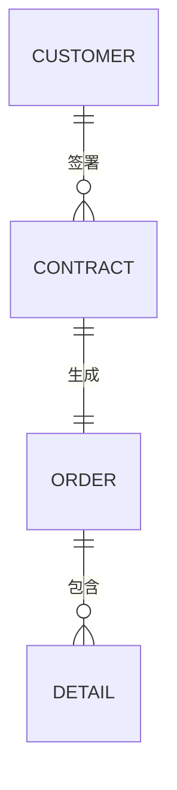
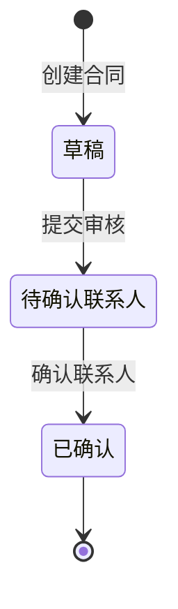
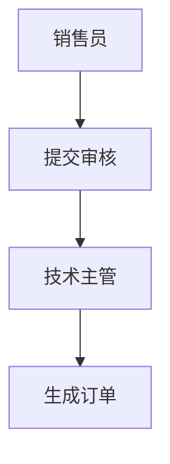

# 产品详细设计文档编写指南（去技术化版）

## 概述

本指南专为产品经理设计，帮助你编写"去技术化"的详细设计文档，聚焦于**业务逻辑、交互行为与数据规则**的定义。

## 核心理念

> **消除需求文档（PRD）与开发实现之间的模糊地带**

产品经理应该关注：
- ✅ 业务逻辑是什么（What）
- ✅ 为什么要这样设计（Why）
- ✅ 用户如何交互（How - 用户视角）
- ✅ 数据如何流转和约束（Data Rules）

技术团队负责：
- 数据库表结构设计
- API接口定义
- 技术架构选型
- 代码逻辑实现

## 编写原则

### 1. 去技术化（Detechnicalization）

**避免使用：**
- ❌ 编程语言语法（Java/C#/Python等）
- ❌ 数据库设计语句（CREATE TABLE/INDEX等）
- ❌ API接口定义（REST/GraphQL/Swagger等）
- ❌ 技术架构术语（微服务/SOA/Serverless等）
- ❌ 部署运维内容（Docker/K8s/CI/CD等）

**应该使用：**
- ✅ 业务语言和表格
- ✅ 业务对象定义
- ✅ 状态流转规则
- ✅ 数据交换需求
- ✅ 用户体验要求

### 2. 业务聚焦（Business Focus）

**聚焦三大核心：**

1. **业务逻辑** - What & Why
   - 业务对象关系（客户、订单、产品等）
   - 状态流转规则（草稿→待审核→已完成）
   - 业务约束条件（金额>0、日期不能早于今天）

2. **交互行为** - How (用户视角)
   - 业务流程设计（BPMN 2.0流程图）
   - 界面交互规则（点击A按钮后B字段自动填充）
   - 操作步骤说明（第一步→第二步→第三步）

3. **数据规则** - Data Rules
   - 数据精度要求（金额保留2位小数）
   - 数据长度限制（文本最多200字符）
   - 数据交换规则（与ERP系统的数据对应关系）

### 3. 标准化（Standardization）

- 统一的文档结构（7章框架）
- 规范的术语定义
- 明确的验收标准
- 可追溯的需求-设计链路
- 统一的排版格式

## 文档格式要求

> **所有详细设计文档必须遵从以下排版参数，以确保打印与归档的统一性。**

### 页面设置

- **纸张大小**：A4 标准纸
- **页边距**：左右边距 3.18cm，上下边距 2.54cm
- **页码**：页脚居中显示

### 正文格式

- **字体**：宋体，小四号（12pt）
- **行距**：1.5倍
- **首行缩进**：正文段落首行缩进 2 字符
- **英文字体**：Times New Roman（用于数字、英文单词）

### 标题分级标准

文档标题严格执行以下分级标准：

| 标题级别 | 字号 | 格式 | 序号格式 | 示例 |
|---------|------|------|----------|------|
| 一级标题 | 二号（22pt） | 加粗 | 中文数字"一、" | 一、文档概览 |
| 二级标题 | 小二（18pt） | 加粗 | 中文数字加括号"（一）" | （一）项目背景 |
| 三级标题 | 三号（16pt） | 加粗 | 阿拉伯数字"1." | 1. 业务背景 |
| 四级标题 | 小四（12pt） | 加粗 | 阿拉伯数字加括号"（1）" | （1）业务痛点 |

### 格式转换说明

**从 Markdown 到 Word/PDF：**

本模板使用 Markdown 格式编写以支持版本控制，导出为 Word/PDF 时需按上述格式调整：

| Markdown格式 | Word格式 |
|-------------|----------|
# 标题 | 一、标题（二号，加粗） |
## 标题 | （一）标题（小二，加粗） |
### 标题 | 1. 标题（三号，加粗） |
#### 标题 | （1）标题（小四，加粗） |

**操作建议：**
1. 在 Word 中使用"样式"功能统一格式
2. 设置默认字体为宋体小四，行距1.5倍
3. 设置段落首行缩进2字符
4. 使用"多级列表"自动编号，按标题级别设置

### 格式检查清单

文档完成后，使用以下清单检查格式：

- [ ] 纸张大小为A4
- [ ] 页边距：左右3.18cm，上下2.54cm
- [ ] 页码居中显示在页脚
- [ ] 正文：宋体小四，行距1.5倍
- [ ] 段落首行缩进2字符
- [ ] 数字和英文使用Times New Roman字体
- [ ] 一级标题：二号加粗，序号"一、"
- [ ] 二级标题：小二加粗，序号"（一）"
- [ ] 三级标题：三号加粗，序号"1."
- [ ] 四级标题：小四加粗，序号"（1）"

## 文档结构详解

### 第1章：文档概览

**目标**：让读者快速了解项目全貌

**包含内容：**
- 项目背景（解决什么业务问题）
- 项目目标（达成什么业务价值）
- 范围边界（做什么、不做什么）
- 术语定义（统一业务语言）

**编写要点：**
- 用业务语言描述，避免技术术语
- 量化目标（如"提升20%效率"而非"优化性能"）
- 明确不做的功能，避免需求蔓延

### 第2章：系统功能架构

**目标**：描述系统的业务模块组成

**包含内容：**
- 业务模块关系（客户管理→订单管理→生产管理）
- 角色与权限（销售经理可以做什么、不能做什么）

**编写要点：**
- 用业务模块而非技术分层
- 角色从业务角度定义（销售经理、仓储员）
- 权限说明操作权限（查看/新增/修改/删除）

### 第3章：核心业务对象

**目标**：定义系统中的业务实体及其关系

**包含内容：**
- 业务对象关系图（ERD，去掉PK/FK技术标记）
- 业务对象属性说明（填写说明、数据来源、备注）
- 状态机设计（状态定义、流转规则、系统动作）

**编写要点：**
- ERD图仅显示业务属性，去掉技术标记
- 属性表包含"是否必填"、"填写说明"、"数据来源"
- 状态机必须包含状态转换规则表

**示例：合同状态流转**

| 当前状态 | 触发操作 | 前置条件 | 转换后状态 | 系统动作 |
|---------|---------|---------|-----------|----------|
| 草稿 | 提交审核 | 合同信息完整 | 待确认联系人 | 发送通知 |
| 待确认联系人 | 确认联系人 | 指定技术联系人 | 已确认 | 生成技术任务 |

### 第4章：功能模块设计

**目标**：详细描述每个功能模块的业务规则和数据交换需求

**包含内容：**
- （一）功能模块（如模块一、模块二等）
  - 功能概述
  - 业务规则（进入条件、业务约束、异常处理）
  - 业务流程设计（BPMN 2.0流程图）
  - 界面与交互（界面布局、交互说明表）
  - 业务处理步骤（非伪代码，用自然语言）
- 5. 数据交换需求（跨模块的数据交换）
  - （1）与其他系统的数据交换
  - （2）数据同步规则

**编写要点：**
- 使用BPMN 2.0标准绘制流程图
- 交互说明表包含：输入限制、联动规则、提示信息、默认值
- 处理步骤用"步骤1/2/3"而非"FUNCTION/END IF"
- 数据交换需求使用阿拉伯数字"5."表示它是第4章下的第5个模块

**示例：保存合同的处理步骤**

**步骤1：验证输入**
- 检查客户名称是否为空
- 检查合同金额是否为有效数字
- 检查签订日期是否有效

**步骤2：计算金额**
- 含税金额 = 合同金额 × 1.13
- 保留2位小数

**步骤3：保存数据**
- 记录订单编号
- 关联客户信息
- 设置初始状态为"草稿"

### 第5章：业务约束与体验要求

**目标**：定义用户体验要求和业务规则约束

**包含内容：**
- （一）用户体验要求
  - 响应速度要求
  - 易用性要求
  - 可用性要求
- （二）业务规则约束
  - 数据精度要求
  - 数据长度限制
  - 业务逻辑约束
- （三）安全与合规
  - 访问控制
  - 数据安全
  - 操作审计

**编写要点：**
- 从用户角度描述体验（如"保存订单≤1秒"）
- 业务约束用自然语言（如"订单金额必须大于0"）
- 安全要求从业务角度（如"只能访问权限范围内的数据"）

**示例：业务逻辑约束**

**金额约束：**
- 订单金额必须大于0
- 折扣金额不能超过原价
- 含税金额 = 不含税金额 × (1 + 税率)

### 第6章：附录

**目标**：提供补充信息

**包含内容：**
- （一）参考文献（GB/T 8567-2006、BPMN 2.0标准）
- （二）相关文档（PRD、测试用例、用户手册）
- （三）设计评审记录

## 最佳实践

### 1. 使用表格而非大段文字

**❌ 不推荐：**
```
当用户点击保存按钮时，系统首先会验证客户名称是否为空，如果为空则提示错误，如果不为空则继续验证合同金额是否为有效数字...
```

**✅ 推荐：**
| 界面元素 | 输入限制 | 提示信息 |
|---------|---------|----------|
| 客户名称 | 必填 | 请选择客户 |
| 合同金额 | 必填，保留2位小数 | 请输入数字 |

### 2. 使用Mermaid绘制图表

**ERD图示例：**


**状态流转图示例：**


**BPMN流程图示例：**


### 3. 状态转换规则必须完整

每个核心单据的状态机必须包含：
- 状态定义表（状态代码、状态名称、状态说明）
- 状态流转图（Mermaid stateDiagram）
- 状态转换规则表（当前状态、触发操作、前置条件、转换后状态、系统动作）

### 4. 界面交互要描述联动逻辑

**示例：交互说明表**

| 界面元素 | 元素类型 | 输入限制 | 联动规则 | 提示信息 |
|---------|---------|----------|----------|----------|
| 客户名称 | 下拉选择 | 必填 | 选择后自动填充联系人 | 请选择客户 |
| 合同金额 | 数字输入 | 必填 | 自动计算含税金额 | 请输入数字 |

### 5. 业务处理步骤要清晰

**❌ 避免伪代码：**
```
FUNCTION Save_Contract(data)
    IF data.customer IS EMPTY THEN
        RETURN ERROR()
    END IF
END FUNCTION
```

**✅ 使用业务步骤：**
```
步骤1：验证输入
- 检查客户名称是否为空
- 检查合同金额是否为有效数字

步骤2：计算金额
- 含税金额 = 合同金额 × 1.13
```

## 常见问题

### Q1: 如何判断是否过于技术化？

**A**: 检查清单：
- 是否包含编程语言语法？（Java/C#/Python/SQL等）→ 技术化
- 是否包含数据库设计？（CREATE TABLE/INDEX等）→ 技术化
- 是否包含API接口定义？（REST/GraphQL/Swagger等）→ 技术化
- 是否包含技术架构选型？（微服务/Docker/K8s等）→ 技术化

如果有以上内容，说明过于技术化，需要改写为业务描述。

### Q2: 状态机设计有什么要求？

**A**: 每个核心单据（如合同、订单）必须包含：
1. 状态定义表（列出所有状态及说明）
2. 状态流转图（Mermaid stateDiagram）
3. 状态转换规则表（5列：当前状态、触发操作、前置条件、转换后状态、系统动作）

### Q3: 如何描述复杂的业务逻辑？

**A**: 使用"业务处理步骤"而非伪代码
- 步骤1：验证XX
- 步骤2：计算XX
- 步骤3：保存XX
- 步骤4：返回XX

### Q4: 与开发人员如何对接？

**A**:
- 产品经理：编写业务逻辑、交互行为、数据规则（本文档）
- 技术负责人：编写技术架构文档（TDD）
- 开发人员：基于业务设计进行技术实现

### Q5: 什么时候更新文档？

**A**:
- 需求变更时：立即更新业务规则
- 设计评审时：根据反馈调整
- 上线验收时：确保文档与实际一致

## 质量检查清单

### 完整性检查

- [ ] 6个章节都已填写
- [ ] 核心业务对象有ERD图
- [ ] 核心单据有状态机设计
- [ ] 关键流程有BPMN图
- [ ] 交互界面有说明表

### 去技术化检查

- [ ] 无编程语言语法
- [ ] 无数据库设计语句
- [ ] 无API接口定义
- [ ] 无技术架构选型

### 业务聚焦检查

- [ ] 业务对象定义清晰
- [ ] 状态流转规则完整
- [ ] 界面交互逻辑明确
- [ ] 数据规则约束具体

### 可测试性检查

- [ ] 每个业务规则可验证
- [ ] 状态机路径可覆盖
- [ ] 交互逻辑可测试
- [ ] 数据约束可检查

## 工具推荐

### 文档编写
- **Markdown编辑器**：Typora, VS Code, Obsidian
- **图表工具**：Mermaid（推荐，版本控制友好）
- **版本控制**：Git, GitHub, GitLab

### 文档导出
- **PDF导出**：Typora, VS Code插件, Pandoc
- **Word导出**：Pandoc

### 协作工具
- **在线协作**：HackMD, Notion
- **代码审查**：GitHub PR, GitLab MR

## 参考标准

- GB/T 8567-2006 计算机软件文档编制规范
- BPMN 2.0 业务流程模型与符号标准
- 天云聚合详细设计文档规范（去技术化版）

## 总结

编写好的"去技术化"详细设计文档需要：

1. **聚焦业务** - 关注业务逻辑、交互行为、数据规则
2. **去除技术** - 避免编程语法、数据库设计、API定义
3. **使用表格** - 用表格清晰表达结构化信息
4. **图表辅助** - 用Mermaid绘制ERD、状态机、流程图
5. **持续更新** - 文档随需求演进而更新

记住：产品经理的价值在于定义"做什么"和"为什么"，"怎么做"留给技术团队。

---

**版本**: v2.0 (去技术化版)
**最后更新**: 2026-01-14
**许可证**: MIT
