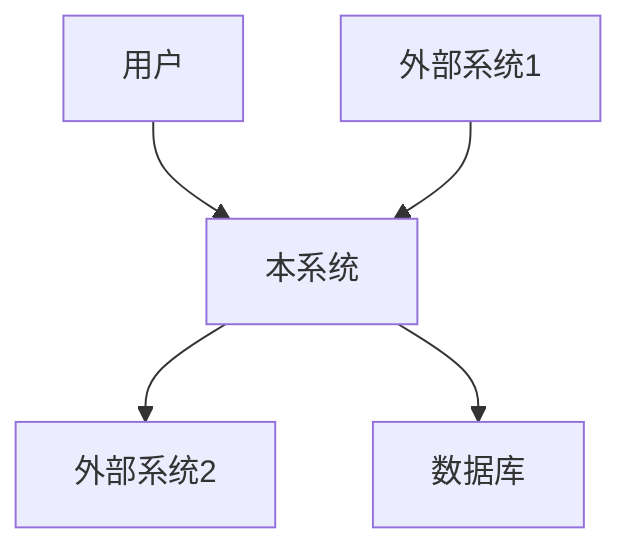
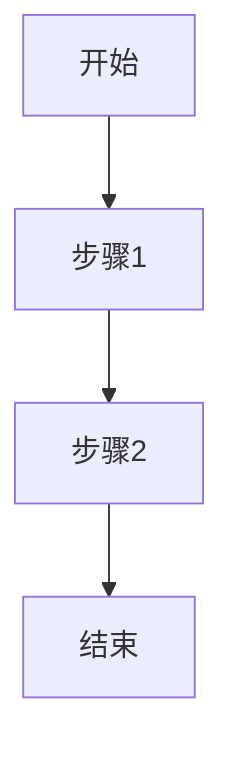
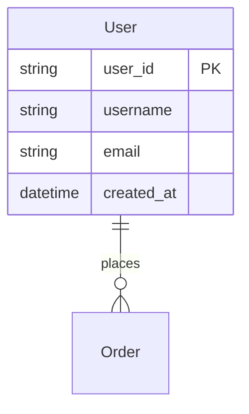
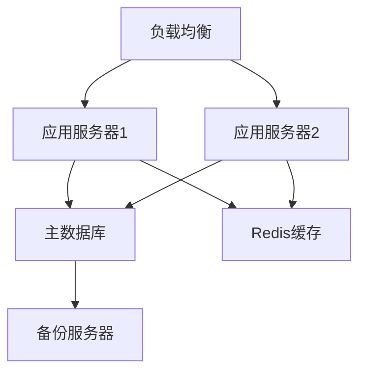

# [项目名称] 详细设计文档

## 文档元数据

| 属性 | 值 |
|------|-----|
| **项目名称** | [项目名称] |
| **文档版本** | v1.0.0 |
| **创建日期** | [YYYY-MM-DD] |
| **最后更新** | [YYYY-MM-DD] |
| **作者** | [作者姓名] |
| **组织** | [组织名称] |
| **文档状态** | [草稿/评审中/已批准] |

---

## 修订历史

| 版本 | 日期 | 作者 | 变更说明 |
|------|------|------|----------|
| v1.0.0 | [YYYY-MM-DD] | [作者] | 初始版本 |

---

## 目录

- [1. 引言](#1-引言)
  - [1.1 编写目的](#11-编写目的)
  - [1.2 项目背景](#12-项目背景)
  - [1.3 文档范围](#13-文档范围)
  - [1.4 术语和缩略语](#14-术语和缩略语)
  - [1.5 参考资料](#15-参考资料)
  - [1.6 文档约定](#16-文档约定)
- [2. 设计概述](#2-设计概述)
  - [2.1 利益相关者](#21-利益相关者)
  - [2.2 设计关注点](#22-设计关注点)
  - [2.3 设计原则](#23-设计原则)
  - [2.4 架构视角选择](#24-架构视角选择)
- [3. 应用架构视图](#3-应用架构视图)
  - [3.1 约束条件](#31-约束条件)
  - [3.2 非功能性需求](#32-非功能性需求)
  - [3.3 系统架构](#33-系统架构)
  - [3.4 功能模块设计](#34-功能模块设计)
  - [3.5 接口设计](#35-接口设计)
  - [3.6 数据设计](#36-数据设计)
- [4. 开发架构视图](#4-开发架构视图)
  - [4.1 约束条件](#41-约束条件)
  - [4.2 非功能性需求](#42-非功能性需求)
  - [4.3 技术栈](#43-技术栈)
  - [4.4 项目结构](#44-项目结构)
  - [4.5 设计模式](#45-设计模式)
  - [4.6 代码组织](#46-代码组织)
- [5. 安全架构视图](#5-安全架构视图)
  - [5.1 约束条件](#51-约束条件)
  - [5.2 非功能性需求](#52-非功能性需求)
  - [5.3 安全策略](#53-安全策略)
  - [5.4 身份认证与授权](#54-身份认证与授权)
  - [5.5 数据安全](#55-数据安全)
  - [5.6 安全合规](#56-安全合规)
- [6. 规模与性能视图](#6-规模与性能视图)
  - [6.1 约束条件](#61-约束条件)
  - [6.2 非功能性需求](#62-非功能性需求)
  - [6.3 性能指标](#63-性能指标)
  - [6.4 容量规划](#64-容量规划)
  - [6.5 性能优化策略](#65-性能优化策略)
  - [6.6 监控与告警](#66-监控与告警)
- [7. 基础设施架构视图](#7-基础设施架构视图)
  - [7.1 约束条件](#71-约束条件)
  - [7.2 非功能性需求](#72-非功能性需求)
  - [7.3 部署架构](#73-部署架构)
  - [7.4 网络架构](#74-网络架构)
  - [7.5 运维管理](#75-运维管理)
  - [7.6 灾备与容灾](#76-灾备与容灾)
- [8. 架构决策记录](#8-架构决策记录)
  - [8.1 关键技术选型](#81-关键技术选型)
  - [8.2 架构决策](#82-架构决策)
  - [8.3 未决事项](#83-未决事项)
- [9. 附录](#9-附录)
  - [9.1 架构图](#91-架构图)
  - [9.2 数据模型](#92-数据模型)
  - [9.3 API文档](#93-api文档)
  - [9.4 配置说明](#94-配置说明)

---

## 1. 引言

### 1.1 编写目的

> 说明编写本文档的目的、预期读者和使用场景

本文档旨在详细描述[项目名称]的系统架构和设计细节，为开发团队提供清晰的技术指导，为测试和运维团队提供系统理解的基础。

**预期读者：**
- 软件架构师
- 开发工程师
- 测试工程师
- 运维工程师
- 项目管理人员

### 1.2 项目背景

> 描述项目的业务背景、目标和价值

[描述项目要解决的业务问题、目标用户、预期价值等]

### 1.3 文档范围

> 明确文档覆盖的范围和不包含的内容

**包含范围：**
- 系统总体架构设计
- 各功能模块详细设计
- 接口设计规范
- 数据结构设计
- 非功能性需求设计
- 部署和运维设计

**不包含范围：**
- 详细代码实现（不包含类图、序列图等细节）
- 需求规格说明（参见需求文档）
- 测试用例（参见测试文档）

### 1.4 术语和缩略语

| 术语/缩略语 | 全称 | 说明 |
|-----------|------|------|
| API | Application Programming Interface | 应用程序编程接口 |
| [示例] | [示例] | [示例说明] |

### 1.5 参考资料

| 序号 | 文档名称 | 版本 | 作者/来源 |
|------|---------|------|----------|
| 1 | [需求文档链接] | v1.0 | [作者] |
| 2 | [技术标准文档] | [版本] | [来源] |

### 1.6 文档约定

> 说明文档中的特殊约定、标记规范等

- `[TODO]` - 表示待完成的内容
- `[WIP]` - 表示正在进行的工作
- `N/A` - 表示不适用

---

## 2. 设计概述

### 2.1 利益相关者

| 角色 | 名称 | 主要关注点 |
|------|------|-----------|
| 产品经理 | [姓名] | 业务目标、用户体验 |
| 技术负责人 | [姓名] | 技术可行性、架构质量 |
| 开发团队 | [团队] | 实现细节、开发效率 |
| 运维团队 | [团队] | 可维护性、可监控性 |
| 安全团队 | [团队] | 安全合规、风险控制 |

### 2.2 设计关注点

| 关注点类别 | 具体关注点 | 优先级 |
|-----------|-----------|--------|
| 业务价值 | 功能完整性、用户体验 | 高 |
| 技术质量 | 可维护性、可扩展性 | 高 |
| 性能 | 响应时间、吞吐量 | 中 |
| 安全 | 数据安全、权限控制 | 高 |
| 运维 | 部署便捷性、可监控性 | 中 |

### 2.3 设计原则

> 列出系统设计的核心原则

1. **简单性优先** - 保持设计简洁，避免过度设计
2. **松耦合** - 模块间低耦合，高内聚
3. **可扩展性** - 支持未来功能扩展
4. **可测试性** - 设计易于测试
5. **安全性** - 安全左移，默认安全

### 2.4 架构视角选择

> 说明选择哪些架构视角以及原因

本文档采用以下五个架构视角：

| 视角 | 目标受众 | 主要关注点 |
|------|---------|-----------|
| 应用视图 | 产品经理、业务分析师 | 功能模块、业务流程 |
| 开发视图 | 开发工程师 | 技术实现、代码组织 |
| 安全视图 | 安全工程师、审计人员 | 安全策略、合规要求 |
| 规模视图 | 架构师、性能工程师 | 性能指标、容量规划 |
| 基础设施视图 | 运维工程师、DevOps | 部署架构、运维管理 |

---

## 3. 应用架构视图

### 3.1 约束条件

> 列出应用层面的约束条件

**技术约束：**
- 必须使用[特定技术/框架]
- 兼容[特定浏览器/操作系统]

**业务约束：**
- 预算限制：[金额]
- 时间限制：[日期]

**合规约束：**
- 必须符合[法规/标准]要求

### 3.2 非功能性需求

| 类别 | 需求描述 | 优先级 | 验收标准 |
|------|---------|--------|----------|
| 可用性 | 系统可用性 ≥ 99.9% | 高 | 月度 downtime < 43.2分钟 |
| 易用性 | 用户可在30分钟内学会使用 | 中 | 用户培训时间 < 30分钟 |
| 可维护性 | 代码规范覆盖率100% | 中 | 通过代码审查 |
| 可移植性 | 支持主流操作系统 | 低 | 通过兼容性测试 |

### 3.3 系统架构

#### 3.3.1 系统上下文图

> 展示系统与外部系统、用户的关系



#### 3.3.2 架构风格

> 说明采用的架构风格及其理由

**架构风格：** [微服务/分层/MVC/事件驱动等]

**选择理由：**
- 理由1
- 理由2

### 3.4 功能模块设计

#### 3.4.1 模块列表

| 模块名称 | 功能描述 | 负责人 | 状态 |
|---------|---------|--------|------|
| 模块A | [描述] | [负责人] | [状态] |
| 模块B | [描述] | [负责人] | [状态] |

#### 3.4.2 模块详细设计

**模块名称：[模块名]**

**功能描述：**
- 功能1
- 功能2

**主要接口：**
- 接口1：[描述]
-接口2：[描述]

**关键流程：**


### 3.5 接口设计

#### 3.5.1 外部接口

| 接口名称 | 协议 | 格式 | 认证方式 | 说明 |
|---------|------|------|----------|------|
| API1 | REST | JSON | OAuth2.0 | [描述] |
| API2 | gRPC | Protobuf | JWT | [描述] |

#### 3.5.2 内部接口

| 接口名称 | 调用方 | 提供方 | 协议 | 说明 |
|---------|--------|--------|------|------|
| ServiceA | Module1 | Module2 | REST | [描述] |

### 3.6 数据设计

#### 3.6.1 数据模型

> 描述核心数据实体和关系

**核心实体：**

**用户 (User)**
- user_id: string - 用户唯一标识
- username: string - 用户名
- email: string - 邮箱
- created_at: datetime - 创建时间

**ER图：**


#### 3.6.2 数据存储设计

| 数据类型 | 存储方案 | 选型理由 |
|---------|---------|----------|
| 业务数据 | PostgreSQL | 关系型数据，ACID保证 |
| 缓存数据 | Redis | 高性能读写 |
| 文件存储 | S3/OSS | 大规模对象存储 |

---

## 4. 开发架构视图

### 4.1 约束条件

> 列出开发层面的约束条件

**技术约束：**
- 编程语言：[语言]
- 框架版本：[版本]
- IDE要求：[IDE]

**团队约束：**
- 团队规模：[人数]
- 技能水平：[描述]

### 4.2 非功能性需求

| 类别 | 需求描述 | 优先级 | 验收标准 |
|------|---------|--------|----------|
| 可读性 | 代码注释覆盖率 ≥ 30% | 中 | 通过静态分析 |
| 可测试性 | 单元测试覆盖率 ≥ 80% | 高 | 通过测试报告 |
| 可维护性 | 圈复杂度 ≤ 10 | 中 | 通过代码质量检查 |

### 4.3 技术栈

#### 4.3.1 后端技术栈

| 技术 | 版本 | 用途 | 选型理由 |
|------|------|------|----------|
| [语言] | [版本] | 主要开发语言 | [理由] |
| [框架] | [版本] | Web框架 | [理由] |
| [数据库] | [版本] | 数据存储 | [理由] |

#### 4.3.2 前端技术栈

| 技术 | 版本 | 用途 | 选型理由 |
|------|------|------|----------|
| [框架] | [版本] | UI框架 | [理由] |
| [库] | [版本] | 状态管理 | [理由] |

### 4.4 项目结构

> 展示项目的目录结构

```
project-root/
├── docs/              # 文档
├── src/
│   ├── main/          # 主代码
│   │   ├── java/      # Java源码
│   │   └── resources/ # 资源文件
│   └── test/          # 测试代码
├── build/             # 构建输出
└── deploy/            # 部署配置
```

### 4.5 设计模式

> 列出使用的设计模式及场景

| 模式名称 | 应用场景 | 位置 |
|---------|---------|------|
| 单例模式 | 配置管理 | ConfigManager |
| 工厂模式 | 对象创建 | ServiceFactory |
| 观察者模式 | 事件通知 | EventBus |

### 4.6 代码组织

#### 4.6.1 分层架构

```
┌─────────────────────┐
│  Presentation Layer │  表现层 (Controller/API)
├─────────────────────┤
│   Business Layer    │  业务层 (Service/Domain)
├─────────────────────┤
│  Persistence Layer  │  持久层 (Repository/DAO)
└─────────────────────┘
```

#### 4.6.2 代码规范

- 命名规范：[说明]
- 注释规范：[说明]
- 格式规范：[说明]

---

## 5. 安全架构视图

### 5.1 约束条件

> 列出安全层面的约束条件

**法规要求：**
- [GDPR/等保2.0/其他]
- 数据本地化要求：[说明]

**行业标准：**
- [OWASP Top 10]
- [PCI DSS/其他]

### 5.2 非功能性需求

| 类别 | 需求描述 | 优先级 | 验收标准 |
|------|---------|--------|----------|
| 机密性 | 敏感数据加密存储 | 高 | 通过安全审计 |
| 完整性 | 数据传输完整性校验 | 高 | 传输层加密 |
| 可审计性 | 关键操作日志记录 | 中 | 日志保留90天 |

### 5.3 安全策略

#### 5.3.1 纵深防御策略

```
┌─────────────────────────┐
│   网络安全 (WAF/DDoS)   │
├─────────────────────────┤
│   应用安全 (认证/授权)  │
├─────────────────────────┤
│   数据安全 (加密/脱敏)  │
├─────────────────────────┤
│   主机安全 (HIDS/补丁)  │
└─────────────────────────┘
```

#### 5.3.2 威胁建模

| 威胁类型 | 风险等级 | 应对措施 |
|---------|---------|----------|
| SQL注入 | 高 | 参数化查询、ORM |
| XSS攻击 | 中 | 输入验证、输出编码 |
| CSRF攻击 | 中 | CSRF Token |

### 5.4 身份认证与授权

#### 5.4.1 认证机制

| 认证方式 | 应用场景 | 安全等级 |
|---------|---------|----------|
| JWT | API调用 | 中 |
| OAuth2.0 | 第三方登录 | 高 |
| MFA | 敏感操作 | 高 |

#### 5.4.2 授权模型

**RBAC (基于角色的访问控制)：**

| 角色 | 权限 |
|------|------|
| 管理员 | 所有权限 |
| 普通用户 | 读写自己的数据 |
| 访客 | 只读公开数据 |

### 5.5 数据安全

#### 5.5.1 数据分类

| 分类级别 | 示例 | 保护措施 |
|---------|------|----------|
| 绝密 | [示例] | 加密存储、访问审计 |
| 机密 | [示例] | 加密存储 |
| 内部 | [示例] | 访问控制 |
| 公开 | [示例] | 无特殊要求 |

#### 5.5.2 加密策略

| 数据类型 | 加密算法 | 密钥管理 |
|---------|---------|----------|
| 传输数据 | TLS 1.3 | 证书管理 |
| 存储数据 | AES-256 | KMS |
| 敏感字段 | AES-256 | 应用层密钥 |

### 5.6 安全合规

#### 5.6.1 合规要求清单

| 合规项 | 要求 | 实施状态 | 验证方式 |
|--------|------|----------|----------|
| [合规项1] | [描述] | [状态] | [方式] |
| [合规项2] | [描述] | [状态] | [方式] |

---

## 6. 规模与性能视图

### 6.1 约束条件

> 列出规模与性能层面的约束条件

**业务约束：**
- 预期用户规模：[数量]
- 日活用户：[数量]
- 峰值QPS：[数量]

**资源约束：**
- 预算限制：[金额]
- 服务器资源：[配置]

### 6.2 非功能性需求

| 类别 | 需求描述 | 优先级 | 验收标准 |
|------|---------|--------|----------|
| 响应时间 | API响应时间 < 200ms (P95) | 高 | 性能测试 |
| 吞吐量 | 支持1000 QPS | 高 | 压力测试 |
| 并发 | 支持100并发用户 | 中 | 负载测试 |

### 6.3 性能指标

#### 6.3.1 关键性能指标 (KPI)

| 指标 | 目标值 | 监控方式 |
|------|--------|----------|
| API响应时间 (P50) | < 100ms | APM |
| API响应时间 (P95) | < 200ms | APM |
| API响应时间 (P99) | < 500ms | APM |
| 错误率 | < 0.1% | 日志分析 |
| 可用性 | ≥ 99.9% | 监控告警 |

#### 6.3.2 性能基线

| 场景 | 并发数 | 响应时间 | 吞吐量 |
|------|--------|----------|--------|
| 正常负载 | 100 | 50ms | 2000 QPS |
| 峰值负载 | 1000 | 200ms | 5000 QPS |
| 压力测试 | 5000 | 500ms | 8000 QPS |

### 6.4 容量规划

#### 6.4.1 存储容量估算

| 数据类型 | 日增量 | 年增量 | 保留时间 | 总容量 |
|---------|--------|--------|----------|--------|
| 业务数据 | 10 GB | 3.6 TB | 7年 | 25 TB |
| 日志数据 | 50 GB | 18 TB | 90天 | 4.5 TB |
| 备份数据 | 20 GB | 7.2 TB | 30天 | 600 GB |

#### 6.4.2 计算资源估算

| 组件 | CPU | 内存 | 存储 | 实例数 |
|------|-----|------|------|--------|
| 应用服务器 | 4核 | 8 GB | 50 GB | 3 |
| 数据库 | 8核 | 32 GB | 500 GB | 1 |
| 缓存 | 4核 | 16 GB | 100 GB | 1 |

### 6.5 性能优化策略

#### 6.5.1 缓存策略

| 缓存层级 | 缓存技术 | 缓存内容 | 过期策略 |
|---------|---------|----------|----------|
| 应用缓存 | 本地缓存 | 热点数据 | LRU, 5分钟 |
| 分布式缓存 | Redis | 会话、配置 | TTL, 30分钟 |
| CDN缓存 | CDN | 静态资源 | 长期缓存 |

#### 6.5.2 数据库优化

- 索引优化：[说明]
- 分库分表：[说明]
- 读写分离：[说明]
- 查询优化：[说明]

### 6.6 监控与告警

#### 6.6.1 监控指标

| 类别 | 指标 | 告警阈值 | 告警级别 |
|------|------|----------|----------|
| 系统 | CPU使用率 | > 80% | 警告 |
| 系统 | 内存使用率 | > 85% | 警告 |
| 应用 | 响应时间 | > 500ms | 严重 |
| 应用 | 错误率 | > 1% | 严重 |

#### 6.6.2 告警策略

| 告警级别 | 响应时间 | 通知方式 | 负责人 |
|---------|---------|----------|--------|
| 严重 | 5分钟 | 电话+短信 | 运维负责人 |
| 警告 | 30分钟 | 邮件+IM | 开发负责人 |
| 提示 | 1小时 | 邮件 | 相关人员 |

---

## 7. 基础设施架构视图

### 7.1 约束条件

> 列出基础设施层面的约束条件

**环境约束：**
- 云服务商：[AWS/Azure/GCP/阿里云]
- 部署区域：[区域]
- 网络环境：[VPC/子网配置]

**运维约束：**
- 运维团队规模：[人数]
- 运维时间窗口：[时间段]

### 7.2 非功能性需求

| 类别 | 需求描述 | 优先级 | 验收标准 |
|------|---------|--------|----------|
| 可用性 | 单点故障自动切换 | 高 | 故障演练 |
| 可扩展性 | 支持水平扩展 | 中 | 扩容测试 |
| 可管理性 | 统一监控管理 | 中 | 运维审计 |

### 7.3 部署架构

#### 7.3.1 部署架构图



#### 7.3.2 容器化部署

**容器编排：** Kubernetes

**部署单元：**
| 组件 | 容器镜像 | 副本数 | 资源限制 |
|------|---------|--------|----------|
| 应用 | [镜像名]:[tag] | 3 | 2核4G |
| 数据库 | [镜像名]:[tag] | 1 | 4核8G |

#### 7.3.3 部署流程

1. 代码提交 → Git仓库
2. 自动构建 → CI/CD流水线
3. 镜像构建 → Docker Registry
4. 自动部署 → Kubernetes集群
5. 健康检查 → 服务可用性验证

### 7.4 网络架构

#### 7.4.1 网络拓扑

```
Internet
    |
[CDN]
    |
[负载均衡/WAF]
    |
[Web层] → [应用层] → [数据层]
    |
[监控日志]
```

#### 7.4.2 网络分段

| 网络区域 | 访问控制 | 包含组件 |
|---------|---------|----------|
| DMZ区 | 仅对外开放 | 负载均衡、WAF |
| 应用区 | 内网访问 | 应用服务器 |
| 数据区 | 严格访问控制 | 数据库、缓存 |

### 7.5 运维管理

#### 7.5.1 配置管理

**配置管理工具：** [Ansible/Terraform/Helm]

**配置版本控制：** Git

**环境隔离：**
- 开发环境
- 测试环境
- 预发布环境
- 生产环境

#### 7.5.2 日志管理

| 日志类型 | 存储位置 | 保留时间 | 用途 |
|---------|---------|----------|------|
| 应用日志 | ELK/Loki | 30天 | 问题排查 |
| 访问日志 | OSS | 90天 | 访问分析 |
| 审计日志 | OSS | 1年 | 合规审计 |

#### 7.5.3 监控体系

**监控工具：** [Prometheus/Grafana/Zabbix]

**监控层级：**
- 基础设施监控：CPU、内存、磁盘、网络
- 应用监控：性能指标、业务指标
- 日志监控：异常日志、错误日志
- 链路追踪：分布式调用链

### 7.6 灾备与容灾

#### 7.6.1 备份策略

| 备份类型 | 备份频率 | 保留时间 | 存储位置 |
|---------|---------|----------|----------|
| 全量备份 | 每天 | 30天 | 异地存储 |
| 增量备份 | 每小时 | 7天 | 本地+异地 |
| 日志备份 | 实时 | 90天 | 异地存储 |

#### 7.6.2 容灾方案

**容灾级别：** [同城双活/异地多活]

**RTO (恢复时间目标)：** [时间]

**RPO (恢复点目标)：** [时间]

**容灾演练：** [频率]

---

## 8. 架构决策记录

### 8.1 关键技术选型

#### 8.1.1 编程语言选择

**决策：** 选择 [语言] 作为主要开发语言

**理由：**
- 理由1：[说明]
- 理由2：[说明]

**权衡：**
| 选项 | 优势 | 劣势 | 评分 |
|------|------|------|------|
| [选项1] | [优势] | [劣势] | 8/10 |
| [选项2] | [优势] | [劣势] | 6/10 |

**结果：** 选择 [选项1]

#### 8.1.2 框架选择

**决策：** 选择 [框架]

**理由：** [说明]

### 8.2 架构决策

#### 8.2.1 决策记录模板

| ID | 决策标题 | 状态 | 日期 | 决策者 |
|----|---------|------|------|--------|
| ADR-001 | [标题] | [已接受/已废弃] | [日期] | [姓名] |

**ADR-001: [决策标题]**

**背景：** [描述面临的背景和问题]

**决策：** [做出的具体决策]

**理由：** [决策的理由和依据]

**后果：**
- 正面影响：[说明]
- 负面影响：[说明]
- 风险：[说明]

**替代方案：**
- 方案1：[描述] - [优劣势]
- 方案2：[描述] - [优劣势]

#### 8.2.2 关键决策列表

| 决策ID | 决策内容 | 影响范围 |
|--------|---------|----------|
| ADR-001 | 微服务架构拆分策略 | 整体架构 |
| ADR-002 | 数据一致性方案 | 数据层 |
| ADR-003 | 消息队列选型 | 应用层 |

### 8.3 未决事项

| ID | 事项描述 | 负责人 | 目标日期 | 状态 |
|----|---------|--------|----------|------|
| TODO-001 | [待解决事项] | [姓名] | [日期] | [状态] |
| TODO-002 | [待解决事项] | [姓名] | [日期] | [状态] |

---

## 9. 附录

### 9.1 架构图

#### 9.1.1 逻辑架构图

> 插入逻辑架构图

#### 9.1.2 部署架构图

> 插入部署架构图

#### 9.1.3 序列图

> 插入关键流程序列图

### 9.2 数据模型

#### 9.2.1 数据字典

| 表名 | 字段名 | 类型 | 长度 | 允许空 | 默认值 | 说明 |
|------|--------|------|------|--------|--------|------|
| user | id | BIGINT | - | N | - | 主键ID |
| user | username | VARCHAR | 50 | N | - | 用户名 |

#### 9.2.2 ER图

> 插入ER图

### 9.3 API文档

#### 9.3.1 API列表

| API路径 | 方法 | 功能描述 | 认证 |
|---------|------|----------|------|
| /api/users | GET | 获取用户列表 | Yes |
| /api/users | POST | 创建用户 | Yes |

#### 9.3.2 API详细说明

**GET /api/users**

**功能描述：** 获取用户列表

**请求参数：**
| 参数名 | 类型 | 必填 | 说明 |
|--------|------|------|------|
| page | int | 否 | 页码，默认1 |
| size | int | 否 | 每页数量，默认20 |

**响应示例：**
```json
{
  "code": 200,
  "message": "success",
  "data": {
    "total": 100,
    "items": [
      {
        "id": 1,
        "username": "user1"
      }
    ]
  }
}
```

### 9.4 配置说明

#### 9.4.1 环境变量

| 变量名 | 说明 | 默认值 | 必填 |
|--------|------|--------|------|
| APP_PORT | 应用端口 | 8080 | 否 |
| DB_HOST | 数据库主机 | localhost | 是 |

#### 9.4.2 配置文件

> 插入配置文件示例

---

## 文档结束

**文档版本：** v1.0.0
**最后更新：** [YYYY-MM-DD]
**审核状态：** [待审核/已审核]

---

**附注：**

本文档遵循以下标准：
- IEEE 1016™-2009 (软件设计描述)
- ISO/IEC/IEEE 42010:2011 (架构描述)

参考模板：
- [bflorat/architecture-document-template](https://github.com/bflorat/architecture-document-template)
- [jam01/SDD-Template](https://github.com/jam01/SDD-Template)
- [shekhargulati/software-architecture-document-template](https://github.com/shekhargulati/software-architecture-document-template)
