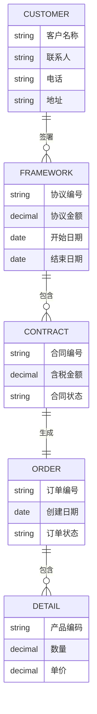
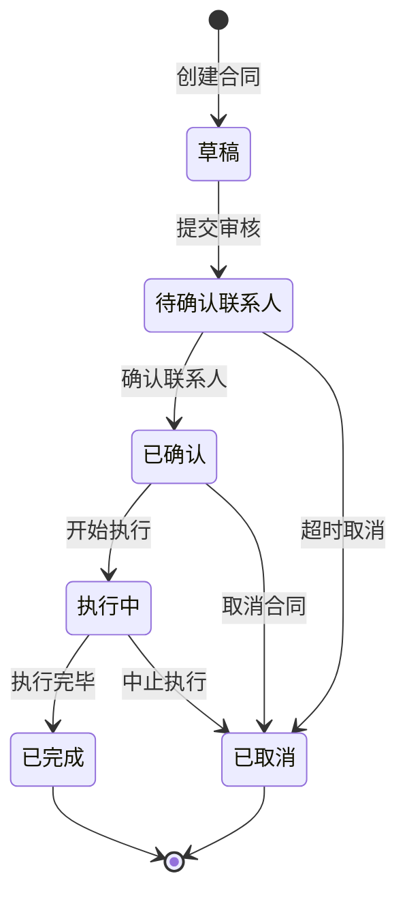
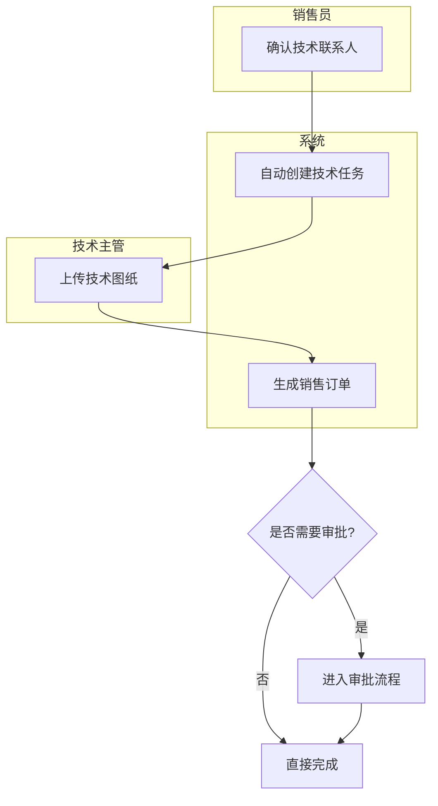

# [项目名称]详细设计文档

**文档状态：** [初稿V1.0 / 修订V1.1]

**编制单位：** [公司名称]

**编制日期：** 202X年X月X日

---

## 文档修订历史

| 版本 | 日期 | 修订人 | 修订说明 | 影响范围 |
|------|------|--------|----------|----------|
| V1.0 | 202X-XX-XX | [姓名] | 初始版本 | - |
| V1.1 | 202X-XX-XX | [姓名] | [修改原因] | [影响模块] |

---

## 目录

- [1. 文档概览](#1-文档概览)
  - [1.1 项目背景与目标](#11-项目背景与目标)
  - [1.2 范围与边界](#12-范围与边界)
  - [1.3 术语与定义](#13-术语与定义)
- [2. 系统功能架构](#2-系统功能架构)
  - [2.1 业务模块关系](#21-业务模块关系)
  - [2.2 角色与权限](#22-角色与权限)
- [3. 核心业务对象](#3-核心业务对象)
  - [3.1 业务对象关系](#31-业务对象关系)
  - [3.2 业务状态流转](#32-业务状态流转)
- [4. 功能模块设计](#4-功能模块设计)
  - [4.1 模块一：[模块名称]](#41-模块一模块名称)
  - [4.2 模块二：[模块名称]](#42-模块二模块名称)
- [5. 数据交换需求](#5-数据交换需求)
  - [5.1 与其他系统的数据交换](#51-与其他系统的数据交换)
  - [5.2 数据同步规则](#52-数据同步规则)
- [6. 业务约束与体验要求](#6-业务约束与体验要求)
  - [6.1 用户体验要求](#61-用户体验要求)
  - [6.2 业务规则约束](#62-业务规则约束)
  - [6.3 安全与合规](#63-安全与合规)
- [7. 附录](#7-附录)
  - [7.1 参考文献](#71-参考文献)
  - [7.2 相关文档](#72-相关文档)

---

<div style="page-break-after: always;"></div>

# 1. 文档概览

## 1.1 项目背景与目标

### 1.1.1 业务背景

　　[描述项目要解决的业务痛点、市场机会]

**示例：**
随着"工业4.0"战略的深入实施，[行业]正面临[具体问题]。本项目的建设初衷是[解决的核心问题]。

### 1.1.2 项目目标

　　本项目的核心目标是[具体目标]，预期将达到[量化指标]。

### 1.1.3 业务价值

　　本项目的实施将产生以下业务价值：
- [价值1]
- [价值2]
- [价值3]

## 1.2 范围与边界

### 1.2.1 项目范围（In-Scope）

　　本项目将包含以下功能模块：

| 模块名称 | 功能描述 | 优先级 |
|---------|---------|--------|
| [模块1] | [描述] | P0 |
| [模块2] | [描述] | P0 |
| [模块3] | [描述] | P1 |

### 1.2.2 不在范围内（Out-Scope）

　　以下功能明确不在本项目范围内：

| 功能项 | 原因 | 替代方案 |
|--------|------|----------|
| [功能1] | [原因] | [方案] |
| [功能2] | [原因] | [方案] |

## 1.3 术语与定义

### 1.3.1 业务术语

| 术语 | 定义 | 示例 |
|------|------|------|
| [术语1] | [定义] | [示例] |
| [术语2] | [定义] | [示例] |

### 1.3.2 缩略语表

| 缩略语 | 全称 | 中文说明 |
|--------|------|----------|
| RBAC | Role-Based Access Control | 基于角色的访问控制 |
| BPMN | Business Process Model and Notation | 业务流程模型与符号 |

---

<div style="page-break-after: always;"></div>

# 2. 系统功能架构

## 2.1 业务模块关系

### 2.1.1 系统功能组成

　　系统由以下业务模块组成：

```
┌─────────────────────────────────┐
│         客户管理模块              │
│  [客户档案] [联系人管理] [拜访记录] │
└──────────────┬───────────────────┘
               │
┌──────────────▼───────────────────┐
│         订单管理模块              │
│  [合同管理] [订单管理] [发货管理] │
└──────────────┬───────────────────┘
               │
┌──────────────▼───────────────────┐
│         生产管理模块              │
│  [生产计划] [进度跟踪] [质量检验] │
└───────────────────────────────────┘
```

### 2.1.2 模块依赖关系

```
营销模块 ──────┐
                ↓
基础数据模块 ─→ 生产模块
                ↑
                │
仓储模块 ──────┘
```

**业务关系说明：**
- 营销模块需要从基础数据模块获取客户信息
- 营销模块向生产模块传递订单需求
- 仓储模块需要根据生产模块的计划安排入库

## 2.2 角色与权限

### 2.2.1 系统角色定义

| 角色名称 | 角色描述 | 可管理的数据范围 |
|---------|---------|-----------------|
| 系统管理员 | 系统最高权限 | 全部数据 |
| 销售经理 | 管理销售订单和客户 | 本部门及下层数据 |
| 技术主管 | 确认技术联系人 | 技术相关数据 |
| 仓储员 | 管理入库出库 | 仓储相关数据 |

### 2.2.2 功能权限矩阵

| 功能模块 | 查看 | 新增 | 修改 | 删除 | 审核 |
|---------|------|------|------|------|------|
| 合同管理 | ✓ | ✓ | ✓ | ✓ | ✓ |
| 订单管理 | ✓ | ✓ | ✓ | ✗ | ✓ |
| 发货管理 | ✓ | ✓ | ✓ | ✗ | ✗ |

**权限说明：**
- ✓：有权限
- ✗：无权限
- "删除合同"仅限未拆分状态下由销售经理操作

### 2.2.3 操作权限说明

| 操作 | 允许的角色 | 限制条件 |
|------|-----------|----------|
| 删除合同 | 系统管理员、销售经理 | 仅未拆分状态 |
| 确认技术联系人 | 技术主管 | - |
| 生成销售订单 | 系统自动 | 合同已确认联系人 |

---

<div style="page-break-after: always;"></div>

# 3. 核心业务对象

## 3.1 业务对象关系

### 3.1.1 核心业务对象

　　系统中的核心业务对象包括：
- 客户
- 框架协议
- 合同
- 销售订单
- 产品明细

### 3.1.2 业务对象关系图



### 3.1.3 业务对象关系说明

| 业务对象A | 关系类型 | 业务对象B | 关系描述 |
|----------|---------|----------|----------|
| 客户 | 1对多 | 框架协议 | 一个客户可以签署多个框架协议 |
| 框架协议 | 1对多 | 合同 | 一个框架协议包含多个合同 |
| 合同 | 1对1 | 销售订单 | 一个合同对应一个销售订单 |
| 销售订单 | 1对多 | 产品明细 | 一个订单包含多个产品明细 |

### 3.1.4 业务对象属性说明

**销售订单属性说明**

| 属性名称 | 是否必填 | 填写说明 | 数据来源 | 备注 |
|---------|---------|----------|----------|------|
| 订单编号 | 是 | 系统自动生成，不可修改 | 系统生成 | 格式：SO-YYYY-NNNN |
| 客户名称 | 是 | 从客户档案中选择 | 选择客户 | 必须先建立客户档案 |
| 合同编号 | 是 | 关联到对应合同 | 选择合同 | 关联后不可修改 |
| 订单金额 | 是 | 自动计算，保留2位小数 | 自动计算 | = 明细金额之和 |
| 订单状态 | 是 | 系统维护 | 系统自动 | 初始为"待发货" |
| 创建日期 | 是 | 系统自动记录 | 系统生成 | 创建订单的时间 |

**字段填写规则：**
- **选择类字段**（如客户名称）：从已有数据中选择，不可手动输入
- **自动生成字段**（如订单编号）：系统按规则生成，用户不可修改
- **计算字段**（如订单金额）：由其他字段自动计算得出

## 3.2 业务状态流转

### 3.2.1 核心单据状态管理

　　在业务系统中，核心单据（如合同、订单）的状态管理是确保业务流程正常运转的关键。必须对每个核心单据明确其状态流转规则。

### 3.2.2 合同状态流转设计

#### 状态定义

| 状态代码 | 状态名称 | 状态说明 |
|---------|---------|----------|
| DRAFT | 草稿 | 合同创建初期，可编辑 |
| PENDING_CONTACT | 待确认联系人 | 已提交，等待确认技术联系人 |
| CONFIRMED | 已确认 | 技术联系人已确认 |
| IN_PROGRESS | 执行中 | 生产计划已下达 |
| COMPLETED | 已完成 | 合同履行完毕 |
| CANCELLED | 已取消 | 合同中止履行 |

#### 状态流转图



#### 状态转换规则表

| 当前状态 | 触发操作 | 前置条件 | 转换后状态 | 系统动作 |
|---------|---------|---------|-----------|----------|
| 草稿 | 提交审核 | 合同信息完整 | 待确认联系人 | 发送通知 |
| 待确认联系人 | 确认联系人 | 指定技术联系人 | 已确认 | 生成技术任务 |
| 待确认联系人 | 超时提醒 | 停留超过24小时 | 待确认联系人 | 推送提醒 |
| 已确认 | 开始执行 | 生产计划下达 | 执行中 | 通知生产部门 |
| 执行中 | 完成执行 | 所有产品交付 | 已完成 | 触发满意度调查 |
| 任意状态 | 取消合同 | 有权限角色操作 | 已取消 | 通知相关人员 |

**业务规则说明：**
- 只有信息完整的合同才能提交审核
- 超过24小时未确认联系人，系统自动推送提醒
- 执行中的合同取消需要业务负责人审批

### 3.2.3 订单状态流转设计

#### 状态定义

| 状态代码 | 状态名称 | 状态说明 |
|---------|---------|----------|
| PENDING | 待发货 | 订单已创建，等待发货 |
| SHIPPING | 运输中 | 司机已接单，货物在途 |
| RECEIVED | 已收货 | 客户已确认收货 |
| COMPLETED | 已完成 | 订单全流程结束 |

#### 状态流转规则

| 当前状态 | 触发条件 | 目标状态 | 备注 |
|---------|---------|----------|------|
| 待发货 | 司机接单 | 运输中 | 需司机在系统确认 |
| 运输中 | 客户上传签收单 | 已收货 | 需客户签字拍照 |
| 已收货 | 系统确认（3天后） | 已完成 | 自动完成 |

---

<div style="page-break-after: always;"></div>

# 4. 功能模块设计

## 4.1 模块一：[模块名称]

### 4.1.1 功能概述

　　[简要说明本模块的功能价值和业务目标]

### 4.1.2 业务规则

#### 进入条件
- [条件1]
- [条件2]

#### 业务约束
- [约束1]
- [约束2]

#### 异常处理
- [异常情况] → [处理方式]
- [异常情况] → [处理方式]

### 4.1.3 业务流程设计

#### 流程图



#### 流程步骤说明

| 步骤 | 执行角色 | 操作说明 | 系统响应 |
|------|---------|----------|----------|
| 1 | 销售员 | 确认技术联系人 | 保存联系人信息 |
| 2 | 系统 | 自动创建技术任务 | 生成任务单号 |
| 3 | 技术主管 | 上传技术图纸 | 存储附件 |
| 4 | 系统 | 生成销售订单 | 更新订单状态 |

#### 流程分支说明

**分支判断：是否需要审批**
- 是 → 进入审批流程，由上级审核
- 否 → 直接完成，无需审批

### 4.1.4 界面与交互

#### 界面布局

```
┌───────────────────────────────────┐
│  合同管理                           │
├───────────────────────────────────┤
│  客户名称    [______________]  🔍  │
│  合同金额    [______________]       │
│  签订日期    [____年__月__日]       │
│  技术联系人  [请选择...]        📂  │
│                                      │
│  [ 保存 ]  [ 提交 ]  [ 取消 ]        │
└───────────────────────────────────┘
```

#### 交互说明表

| 界面元素 | 元素类型 | 输入限制 | 联动规则 | 提示信息 | 默认值 |
|---------|---------|----------|----------|----------|--------|
| 客户名称 | 下拉选择 | 必填 | 选择后自动填充联系人 | 请选择客户 | 空 |
| 合同金额 | 数字输入 | 必填，保留2位小数 | 自动计算含税金额 | 请输入数字 | 0.00 |
| 签订日期 | 日期选择 | 必填 | 不能早于当前日期 | 无效日期 | 当前日期 |
| 技术联系人 | 下拉选择 | 必填 | 仅显示技术部门人员 | 请选择 | 空 |

#### 业务处理步骤

**保存合同的处理逻辑：**

**步骤1：验证输入**
- 检查客户名称是否为空
- 检查合同金额是否为有效数字
- 检查签订日期是否有效

**步骤2：计算金额**
- 含税金额 = 合同金额 × 1.13
- 保留2位小数

**步骤3：保存数据**
- 记录订单编号
- 关联客户信息
- 保存金额信息
- 记录签订日期
- 设置初始状态为"草稿"

**步骤4：返回结果**
- 显示"合同保存成功"
- 刷新合同列表

---

<div style="page-break-after: always;"></div>

## 5. 数据交换需求

## 5.1 与其他系统的数据交换

### 5.1.1 与ERP系统的数据交换

**交换目的：** 将销售订单数据传递给用友ERP系统

**交换内容：**

| 数据项 | 说明 | 是否必传 |
|--------|------|----------|
| 订单编号 | 订单的唯一标识 | 是 |
| 客户编码 | 对应ERP中的客户代码 | 是 |
| 订单金额 | 订单总金额 | 是 |
| 产品明细 | 订单包含的产品列表 | 是 |

**交换时机：**
- 销售订单创建时
- 订单状态变更时

**数据对应关系：**

| 本系统数据项 | ERP系统数据项 | 转换规则 |
|------------|-------------|----------|
| 订单编号 | 订单号 | 直接对应 |
| 客户名称 | 客户代码 | 需转换为ERP编码 |
| 订单金额 | 金额 | 保留2位小数 |
| 产品明细 | 明细行 | 数组格式转换 |

### 5.1.2 与钉钉的消息通知

**通知场景：**
- 合同进入"待确认联系人"状态超过24小时
- 订单状态发生变更
- 出现异常需要处理

**通知内容：**

| 场景 | 通知内容 | 接收人 |
|------|---------|--------|
| 超时提醒 | "合同 SO-2026-001 已滞留24小时，请尽快确认技术联系人" | 销售经理 |
| 状态变更 | "订单 SO-2026-001 状态已变更为'运输中'" | 相关人员 |
| 异常告警 | "订单金额超出信用额度" | 销售经理、财务 |

## 5.2 数据同步规则

### 5.2.1 同步方式

| 同步类型 | 触发方式 | 实时性 | 适用场景 |
|---------|---------|--------|----------|
| 实时推送 | 事件触发 | 秒级 | 紧急数据更新 |
| 定时同步 | 按计划执行 | 分钟级 | 批量数据同步 |
| 手动同步 | 用户操作 | 立即 | 按需同步 |

### 5.2.2 数据一致性保障

**对账机制：**
- 每日凌晨2点自动对账
- 不一致数据自动标记
- 需人工核实后处理

**处理流程：**
1. 系统自动对比数据
2. 发现差异后标记异常
3. 发送通知给管理员
4. 管理员核实并处理

---

<div style="page-break-after: always;"></div>

# 6. 业务约束与体验要求

## 6.1 用户体验要求

### 6.1.1 响应速度要求

| 操作 | 期望响应时间 | 说明 |
|------|------------|------|
| 登录系统 | ≤ 2秒 | 从输入账号到进入首页 |
| 保存订单 | ≤ 1秒 | 点击保存到成功提示 |
| 查询列表 | ≤ 1秒 | 显示查询结果 |
| 导出报表 | ≤ 10秒 | 导出10000条数据 |

### 6.1.2 易用性要求

**操作便捷性：**
- 常用操作不超过3次点击
- 支持快捷键操作
- 支持批量操作

**界面友好性：**
- 提示信息清晰易懂
- 错误信息包含解决建议
- 支持操作撤销

### 6.1.3 可用性要求

| 场景 | 同时在线人数 | 系统表现 |
|------|------------|----------|
| 日常运营 | 100人 | 流畅使用 |
| 业务高峰 | 500人 | 正常使用，略有延迟 |
| 特殊活动 | 1000人 | 可使用，响应较慢 |

## 6.2 业务规则约束

### 6.2.1 数据精度要求

| 数据类型 | 精度要求 | 示例 |
|---------|---------|------|
| 金额 | 保留2位小数 | 1234.56 |
| 百分比 | 保留2位小数 | 85.67% |
| 数量 | 整数 | 100 |
| 日期时间 | YYYY-MM-DD HH:mm | 2026-01-14 10:30 |

### 6.2.2 数据长度限制

| 字段类型 | 最大长度 | 说明 |
|---------|---------|------|
| 文本输入 | 200字符 | 单行文本框 |
| 备注说明 | 1000字符 | 多行文本框 |
| 文件上传 | ≤ 50MB | 附件上传 |
| 图片上传 | ≤ 10MB | 单张图片 |

### 6.2.3 业务逻辑约束

**金额约束：**
- 订单金额必须大于0
- 折扣金额不能超过原价
- 含税金额 = 不含税金额 × (1 + 税率)

**日期约束：**
- 合同签订日期不能晚于生效日期
- 发货日期不能早于订单日期
- 完成日期不能早于开始日期

**状态约束：**
- 已完成的订单不能修改
- 已取消的合同不能恢复
- 只有草稿状态可以删除

## 6.3 安全与合规

### 6.3.1 访问控制

**身份认证：**
- 用户名+密码登录
- 支持扫码登录
- 30分钟无操作自动退出

**权限控制：**
- 不同角色看到不同菜单
- 只能操作权限范围内的数据
- 敏感操作需要二次确认

### 6.3.2 数据安全

**数据访问：**
- 只能访问自己权限范围内的数据
- 敏感数据脱敏显示
- 重要操作记录日志

**数据传输：**
- 使用加密通道传输
- 重要数据不能复制下载
- 定期备份重要数据

### 6.3.3 操作审计

**审计内容：**
- 登录登出记录
- 数据修改记录
- 敏感操作记录

**审计保存：**
- 保存时间：至少1年
- 不可删除
- 可导出查询

---

<div style="page-break-after: always;"></div>

# 7. 附录

## 7.1 参考文献

1. GB/T 8567-2006 计算机软件文档编制规范
2. BPMN 2.0 业务流程模型与符号标准
3. 公司内部文档规范

## 7.2 相关文档

### 上游文档

- [产品需求文档（PRD）](链接)
- [业务流程说明书](链接)
- [用户研究报告](链接)

### 下游文档

- [系统测试用例](链接)
- [用户操作手册](链接)
- [培训材料](链接)

---

## 设计评审记录

| 评审项 | 评审结果 | 评审人 | 评审日期 |
|--------|---------|--------|----------|
| 业务逻辑完整性 | ✅ 通过 | [姓名] | 202X-XX-XX |
| 可测试性 | ✅ 通过 | [姓名] | 202X-XX-XX |
| 可实现性 | ⚠️ 需调整 | [姓名] | 202X-XX-XX |

---

**文档结束**

**编制人：** [姓名]
**审核人：** [姓名]
**批准人：** [姓名]

---

<div style="page-break-after: always;"></div>

## 附录A：文档质量检查清单

### A.1 语言风格检查

- [ ] 未使用"可能"、"大概"、"最好"等模糊词汇
- [ ] 使用"系统应"、"用户必须"等确定性表述
- [ ] 复杂逻辑使用表格或步骤说明而非大段文字
- [ ] 所有术语在术语表中已定义

### A.2 格式规范检查

- [ ] 所有流程图使用BPMN 2.0标准
- [ ] 核心单据有完整的状态流转图
- [ ] 状态转换表包含：当前状态、触发操作、前置条件、转换后状态
- [ ] 业务对象属性表包含：是否必填、填写说明、数据来源
- [ ] 交互说明表包含：输入限制、联动规则、提示信息

### A.3 逻辑完整性检查

- [ ] 正常流程已完整描述
- [ ] 异常流程有处理方案
- [ ] 边界条件已考虑
- [ ] 并发场景已处理

### A.4 可测试性检查

- [ ] 每个业务规则都有明确的验收标准
- [ ] 状态机所有路径都可通过测试覆盖
- [ ] 性能指标可量化、可验证
- [ ] 数据约束有明确的验证方法

---

**文档版本：** V1.0
**最后更新：** 202X年X月X日
**审核状态：** 待评审
