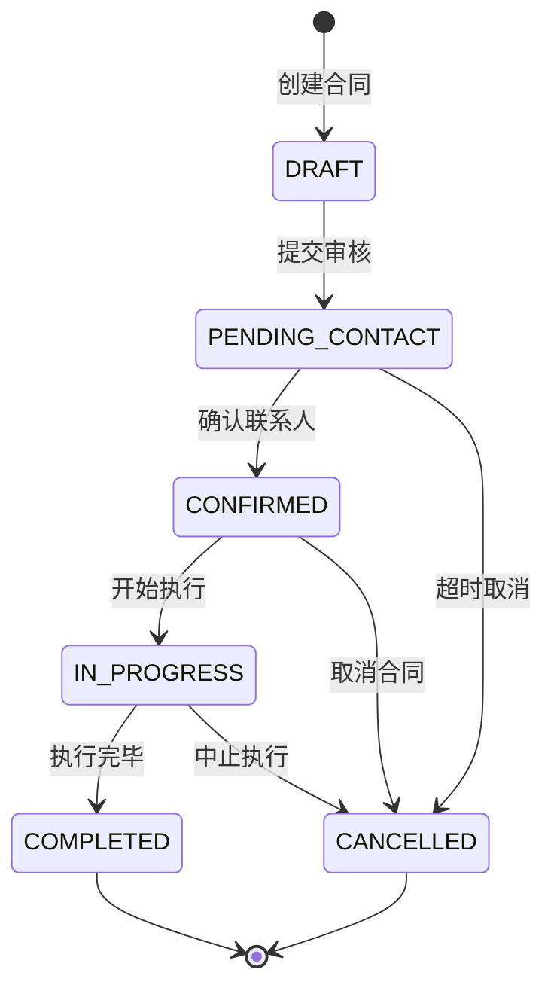

# [项目名称]详细设计文档

**文档状态：** [初稿V1.0 / 修订V1.1]

**编制单位：** [公司名称]

**编制日期：** 202X年X月X日

---

## 文档修订历史

| 版本 | 日期 | 修订人 | 修订说明 | 影响范围 |
|------|------|--------|----------|----------|
| V1.0 | 202X-XX-XX | [姓名] | 初始版本 | - |
| V1.1 | 202X-XX-XX | [姓名] | [修改原因] | [影响模块] |

---

## 目录

- [1. 文档概览](#1-文档概览)
  - [1.1 项目背景与目标](#11-项目背景与目标)
  - [1.2 范围与边界](#12-范围与边界)
  - [1.3 术语与定义](#13-术语与定义)
- [2. 系统逻辑架构](#2-系统逻辑架构)
  - [2.1 功能架构图](#21-功能架构图)
  - [2.2 角色与权限体系](#22-角色与权限体系rbac)
- [3. 核心业务对象模型](#3-核心业务对象模型)
  - [3.1 实体关系图](#31-实体关系图erd---logical)
  - [3.2 状态机模型](#32-状态机模型state-machine)
- [4. 功能模块详细设计](#4-功能模块详细设计)
  - [4.1 模块一：[模块名称]](#41-模块一模块名称)
  - [4.2 模块二：[模块名称]](#42-模块二模块名称)
- [5. 接口与集成设计](#5-接口与集成设计)
  - [5.1 外部系统接口](#51-外部系统接口)
  - [5.2 数据同步策略](#52-数据同步策略)
- [6. 非功能性需求](#6-非功能性需求)
  - [6.1 性能要求](#61-性能要求)
  - [6.2 数据约束](#62-数据约束)
  - [6.3 安全性要求](#63-安全性要求)
- [7. 附录](#7-附录)
  - [7.1 参考文献](#71-参考文献)
  - [7.2 相关文档](#72-相关文档)

---

<div style="page-break-after: always;"></div>

# 1. 文档概览

## 1.1 项目背景与目标

### 1.1.1 业务背景

　　[描述项目要解决的业务痛点、市场机会]

**示例：**
随着"工业4.0"战略的深入实施，[行业]正面临[具体问题]。本项目的建设初衷是[解决的核心问题]。

### 1.1.2 项目目标

　　本项目的核心目标是[具体目标]，预期将达到[量化指标]。

### 1.1.3 战略意义

　　本项目的实施将[对公司业务/客户价值]产生以下影响：
- [影响1]
- [影响2]
- [影响3]

## 1.2 范围与边界

### 1.2.1 项目范围（In-Scope）

　　本项目将包含以下功能模块：

| 模块名称 | 功能描述 | 优先级 |
|---------|---------|--------|
| [模块1] | [描述] | P0 |
| [模块2] | [描述] | P0 |
| [模块3] | [描述] | P1 |

### 1.2.2 不在范围内（Out-Scope）

　　以下功能明确不在本项目范围内：

| 功能项 | 原因 | 替代方案 |
|--------|------|----------|
| [功能1] | [原因] | [方案] |
| [功能2] | [原因] | [方案] |

## 1.3 术语与定义

### 1.3.1 业务术语

| 术语 | 定义 | 示例 |
|------|------|------|
| [术语1] | [定义] | [示例] |
| [术语2] | [定义] | [示例] |

### 1.3.2 系统术语

| 术语 | 全称 | 说明 |
|------|------|------|
| API | Application Programming Interface | 应用程序编程接口 |
| ERP | Enterprise Resource Planning | 企业资源计划 |
| MES | Manufacturing Execution System | 制造执行系统 |

### 1.3.3 缩略语表

| 缩略语 | 全称 | 中文说明 |
|--------|------|----------|
| RBAC | Role-Based Access Control | 基于角色的访问控制 |
| BPMN | Business Process Model and Notation | 业务流程模型与 notation |
| ERD | Entity Relationship Diagram | 实体关系图 |

---

<div style="page-break-after: always;"></div>

# 2. 系统逻辑架构

## 2.1 功能架构图

### 2.1.1 系统总体架构

　　系统采用分层架构设计，各模块之间的层级与依赖关系如下：

```
┌─────────────────────────────────┐
│         表现层 (Presentation)    │
│  [Web前端] [移动端App] [小程序]   │
└──────────────┬───────────────────┘
               │
┌──────────────▼───────────────────┐
│         业务逻辑层 (Business)      │
│  [订单管理] [库存管理] [用户管理]  │
└──────────────┬───────────────────┘
               │
┌──────────────▼───────────────────┐
│         数据访问层 (Data Access)   │
│   [数据访问接口] [缓存管理]       │
└──────────────┬───────────────────┘
               │
┌──────────────▼───────────────────┐
│         数据存储层 (Storage)       │
│  [关系数据库] [缓存] [文件存储]   │
└───────────────────────────────────┘
```

### 2.1.2 模块依赖关系

```
营销模块 ──────┐
                ↓
基础数据模块 ─→ 生产模块
                ↑
                │
仓储模块 ──────┘
```

**说明：**
- 营销模块依赖基础数据模块获取客户信息
- 营销模块向生产模块输出订单数据
- 仓储模块依赖生产模块的生产计划

## 2.2 角色与权限体系（RBAC）

### 2.2.1 系统角色定义

| 角色代码 | 角色名称 | 角色描述 | 数据权限范围 |
|---------|---------|---------|-------------|
| ROLE_ADMIN | 系统管理员 | 系统最高权限 | 全部数据 |
| ROLE_SALES_MGR | 销售经理 | 管理销售订单和客户 | 本部门及下层数据 |
| ROLE_TECH_LEAD | 技术主管 | 确认技术联系人 | 技术相关数据 |
| ROLE_WAREHOUSE | 仓储员 | 管理入库出库 | 仓储相关数据 |

### 2.2.2 功能权限矩阵

| 功能模块 | 查看 | 新增 | 修改 | 删除 | 审核 |
|---------|------|------|------|------|------|
| 合同管理 | ✓ | ✓ | ✓ | ✓ | ✓ |
| 订单管理 | ✓ | ✓ | ✓ | ✗ | ✓ |
| 发货管理 | ✓ | ✓ | ✓ | ✗ | ✗ |

**权限说明：**
- ✓：有权限
- ✗：无权限
- "删除协议"仅限未拆分状态下由销售经理操作

### 2.2.3 按钮级权限控制

| 操作 | 允许的角色 | 限制条件 |
|------|-----------|----------|
| 删除合同 | ROLE_ADMIN, ROLE_SALES_MGR | 仅未拆分状态 |
| 确认技术联系人 | ROLE_TECH_LEAD | - |
| 生成销售订单 | 系统自动 | 合同已确认联系人 |

---

<div style="page-break-after: always;"></div>

# 3. 核心业务对象模型

## 3.1 实体关系图（ERD - Logical）

### 3.1.1 核心实体定义

　　基于ISA-95标准，定义系统中的核心实体及其关系。

**核心实体列表：**
- 客户（Customer）
- 框架协议（Framework Agreement）
- 合同（Contract）
- 销售订单（Sales Order）
- 产品明细（Product Detail）

### 3.1.2 实体关系图（ERD）

```mermaid
erDiagram
    CUSTOMER ||--o{ FRAMEWORK : 签署
    FRAMEWORK ||--o{ CONTRACT : 包含
    CONTRACT ||--|| ORDER : 生成
    ORDER ||--o{ DETAIL : 包含
    CUSTOMER }{
        string customer_id PK
        string customer_name
        string contact_person
        string phone
    }
    FRAMEWORK {
        string framework_id PK
        string customer_id FK
        decimal total_amount
        date start_date
        date end_date
    }
    CONTRACT {
        string contract_id PK
        string framework_id FK
        string contract_code
        decimal tax_included_amount
        string status
    }
    ORDER {
        string order_id PK
        string contract_id FK
        string order_code
        datetime create_time
        string status
    }
    DETAIL {
        string detail_id PK
        string order_id FK
        string product_code
        decimal quantity
        decimal unit_price
    }
```

### 3.1.3 实体关系说明

| 实体A | 关系类型 | 实体B | 关系描述 |
|-------|---------|-------|----------|
| 客户 | 1:N | 框架协议 | 一个客户可以签署多个框架协议 |
| 框架协议 | 1:N | 合同 | 一个框架协议包含多个合同 |
| 合同 | 1:1 | 销售订单 | 一个合同对应一个销售订单 |
| 销售订单 | 1:N | 产品明细 | 一个订单包含多个产品明细 |

### 3.1.4 实体属性定义表

**销售订单实体（Sales_Order）**

| 属性名 | 数据类型 | 是否必填 | 默认值 | 说明 | 字段来源 |
|--------|---------|---------|---------|------|----------|
| order_id | string | 是 | - | 订单唯一标识 | 系统生成 |
| order_code | string | 是 | - | 订单编号 | 自定义编号规则 |
| customer_id | string | 是 | - | 客户ID | 引用自客户档案 |
| contract_id | string | 是 | - | 合同ID | 引用自合同表 |
| total_amount | decimal | 是 | 0.00 | 订单总金额 | 计算字段 |
| status | string | 是 | 'PENDING' | 订单状态 | 枚举值 |
| create_time | datetime | 是 | NOW() | 创建时间 | 系统生成 |

**字段说明：**
- **引用字段**（如customer_id）：引用自其他实体的外键，不可随意修改
- **自有字段**：本实体独立维护的字段
- **计算字段**：由其他字段计算得出（如总金额）

## 3.2 状态机模型（State Machine）

### 3.2.1 核心单据状态机

　　在数字工厂软件中，核心单据（如合同、订单）的状态管理是系统稳定性的基石。必须对每个核心单据绘制状态流转图。

### 3.2.2 合同状态流转详细设计

#### 状态枚举定义

```c
enum ContractStatus {
    DRAFT,              // 草稿
    PENDING_CONTACT,     // 待确认联系人
    CONFIRMED,           // 已确认
    IN_PROGRESS,         // 执行中
    COMPLETED,           // 已完成
    CANCELLED            // 已取消
}
```

#### 状态流转图



#### 状态转换表

| 当前状态 | 触发动作 | 前置条件 | 后置状态 | 后置事件 |
|---------|---------|---------|---------|----------|
| DRAFT | 提交审核 | 合同信息完整 | PENDING_CONTACT | 发送通知 |
| PENDING_CONTACT | 确认联系人 | 指定技术联系人 | CONFIRMED | 生成技术任务 |
| PENDING_CONTACT | 超时处理 | 停留>24小时 | PENDING_CONTACT | 推送钉钉提醒 |
| CONFIRMED | 开始执行 | 生产计划下达 | IN_PROGRESS | 通知生产部门 |
| IN_PROGRESS | 完成执行 | 所有产品交付 | COMPLETED | 触发满意度调查 |
| 任意状态（执行中） | 取消合同 | 有权限角色操作 | CANCELLED | 通知相关人员 |

**设计洞察：**
- 通过状态机设计，开发人员可以清晰编写状态模式代码
- 测试人员可以覆盖所有路径的测试用例
- 避免逻辑漏洞，提升软件健壮性

### 3.2.3 订单状态流转设计

#### 状态枚举定义

| 状态代码 | 状态名称 | 说明 |
|---------|---------|------|
| PENDING | 待发货 | 订单已创建，等待发货 |
| SHIPPING | 运输中 | 司机已接单，货物在途 |
| RECEIVED | 已收货 | 客户已确认收货 |
| COMPLETED | 已完成 | 订单全流程结束 |

#### 状态流转规则

| 当前状态 | 触发条件 | 目标状态 |
|---------|---------|----------|
| PENDING | 司机接单 | SHIPPING |
| SHIPPING | 客户上传签收单 | RECEIVED |
| RECEIVED | 系统确认 | COMPLETED |

---

<div style="page-break-after: always;"></div>

# 4. 功能模块详细设计

## 4.1 模块一：[模块名称]

### 4.1.1 功能概述

　　[简要说明本模块的功能价值和业务目标]

### 4.1.2 业务规则

#### 进入条件
- [条件1]
- [条件2]

#### 业务约束
- [约束1]
- [约束2]

#### 异常处理
- [异常1] → [处理方式]
- [异常2] → [处理方式]

### 4.1.3 业务流程设计（BPMN 2.0）

#### 流程图

```mermaid
flowchart TD
    %% 定义泳道
    |销售员|
    |系统|
    |技术主管|
    |PLM系统|

    %% 定义流程
    sales_node[销售员] --> |系统| sys_task1[系统自动创建技术任务]
    sys_task1 --> |PLM系统| plm_task[接收任务]
    plm_task --> |技术主管| tech_task[上传图纸]
    tech_task --> |系统| sys_task2[系统生成销售订单]

    %% 网关逻辑
    sys_task2{是否需要审批?}
    sys_task2 --> |是| approval[需要审批]
    sys_task2 --> |否| complete[直接完成]
    approval --> complete
```

#### 流程说明

| 步骤 | 执行角色 | 操作说明 | 系统响应 |
|------|---------|----------|----------|
| 1 | 销售员 | 确认技术联系人 | 保存联系人信息 |
| 2 | 系统 | 自动创建技术任务 | 生成任务单号 |
| 3 | PLM系统 | 接收任务 | 更新任务状态 |
| 4 | 技术主管 | 上传图纸 | 存储附件 |
| 5 | 系统 | 生成销售订单 | 更新订单状态 |

#### 网关逻辑说明

**排他网关（XOR）：判断"是否已确认联系人"**
- 是 → 生成任务
- 否 → 进入未确认池

**并行网关（AND）：订单生成后同时执行**
- 推送到ERP
- 发送钉钉通知

### 4.1.4 界面与交互逻辑

#### 页面原型图

```
┌───────────────────────────────────┐
│  合同管理                           │
├───────────────────────────────────┤
│  客户名称    [________________]  🔍     │
│  合同金额    [________________]         │
│  签订日期    [____年__月__日]         │
│  技术联系人  [请选择...]        📂     │
│                                      │
│  [ 保存 ]  [ 提交 ]  [ 取消 ]          │
└───────────────────────────────────┘
```

#### 交互说明表

| 元素 | 类型 | 输入限制 | 联动逻辑 | 异常反馈 | 默认状态 |
|------|------|----------|----------|----------|----------|
| 客户名称 | 下拉框 | 必填 | 选择后自动填充联系人 | 请选择客户 | - |
| 合同金额 | 数字框 | 必填，保留2位小数 | 自动计算含税金额 | 请输入数字 | - |
| 签订日期 | 日期选择 | 必填 | 不能早于当前日期 | 无效日期 | 当前日期 |
| 技术联系人 | 下拉框 | 必填 | 过滤技术部门人员 | 请选择 | - |

#### 处理逻辑（伪代码）

```
FUNCTION Save_Contract(contract_data)

    // 验证必填字段
    IF contract_data.customer_name IS EMPTY THEN
        RETURN ERROR("客户名称不能为空")
    END IF

    // 验证金额格式
    IF contract_data.amount IS NOT NUMERIC THEN
        RETURN ERROR("金额必须为数字")
    END IF

    // 自动计算含税金额
    SET tax_included_amount = contract_data.amount * 1.13

    // 保存到数据库
    INSERT INTO Contract (
        contract_id,
        customer_id,
        amount,
        tax_included_amount,
        sign_date,
        status
    ) VALUES (
        UUID(),
        contract_data.customer_id,
        contract_data.amount,
        tax_included_amount,
        contract_data.sign_date,
        'DRAFT'
    )

    RETURN SUCCESS("合同保存成功")
END FUNCTION
```

---

<div style="page-break-after: always;"></div>

## 5. 接口与集成设计

## 5.1 外部系统接口

### 5.1.1 ERP系统集成接口

**接口名称：** 销售订单同步ERP

**接口描述：** 将销售订单数据推送到用友ERP系统

**接口定义：**

| 项目 | 说明 |
|------|------|
| 接口类型 | 异步推送（REST API） |
| 触发时机 | 销售订单创建或状态变更时 |
| 数据方向 | 本系统 → ERP |
| 同步机制 | 实时推送 + 定时对账（每日凌晨） |

**请求格式：**

```json
{
  "order_id": "SO202601140001",
  "order_code": "SO-2026-001",
  "customer_code": "C001",
  "total_amount": 100000.00,
  "items": [
    {
      "product_code": "P001",
      "quantity": 100,
      "unit_price": 500.00
    }
  ]
}
```

**响应格式：**

```json
{
  "code": "200",
  "message": "同步成功",
  "erp_order_id": "ERP_SO_001"
}
```

**字段映射表：**

| 本系统字段 | ERP字段 | 转换规则 |
|-----------|---------|----------|
| order_code | bill_no | 直接映射 |
| customer_code | customer_id | 查表转换 |
| total_amount | amount | 保留2位小数 |
| items | entry_details | 数组转换 |

### 5.1.2 钉钉集成接口

**接口名称：** 钉钉消息推送

**触发时机：**
- 合同进入"未确认联系人池"超过24小时
- 订单状态变更通知
- 异常告警通知

**消息格式：**

```json
{
  "msgtype": "text",
  "text": {
    "content": "合同 SO-2026-001 已滞留24小时，请尽快确认技术联系人。"
  },
  "at": {
    "atUserIds": ["用户ID"],
    "atMobiles": ["手机号"]
  }
}
```

## 5.2 数据同步策略

### 5.2.1 同步方式对比

| 同步类型 | 触发方式 | 实时性 | 适用场景 |
|---------|---------|--------|----------|
| 实时推送 | 事件触发 | 秒级 | 紧急数据更新 |
| 定时同步 | 定时任务 | 分钟级 | 批量数据同步 |
| 请求应答 | API调用 | 秒级 | 按需查询 |

### 5.2.2 数据一致性保障

**最终一致性策略：**
- 本系统采用异步推送，ERP系统定时对账
- 对账时间窗口：每日凌晨02:00
- 不一致数据自动标记，人工核实后处理

---

<div style="page-break-after: always;"></div>

# 6. 非功能性需求

## 6.1 性能要求

### 6.1.1 响应时间要求

| 功能模块 | 性能指标 | 测试条件 |
|---------|---------|----------|
| 登录响应 | ≤ 2秒 | 并发100用户 |
| 订单保存 | ≤ 1秒 | 单个订单 |
| 列表查询 | ≤ 1秒 | 1000条数据 |
| 报表导出 | ≤ 10秒 | 10000条数据 |

### 6.1.2 并发用户数

| 场景 | 并发用户数 | 响应时间 |
|------|-----------|----------|
| 日常运营 | 100 | ≤ 2秒 |
| 业务高峰 | 500 | ≤ 3秒 |
| 特殊活动 | 1000 | ≤ 5秒 |

## 6.2 数据约束

### 6.2.1 数据精度要求

| 数据类型 | 精度要求 | 示例 |
|---------|---------|------|
| 金额字段 | 保留2位小数 | 1234.56 |
| 百分比 | 保留2位小数 | 85.67% |
| 数量 | 整数 | 100 |
| 日期时间 | YYYY-MM-DD HH:mm:ss | 2026-01-14 10:30:00 |

### 6.2.2 数据长度限制

| 字段类型 | 最大长度 | 说明 |
|---------|---------|------|
| 文本字段 | 200字符 | 单行文本 |
| 备注字段 | 1000字符 | 多行文本 |
| 文件上传 | ≤ 50MB | 附件上传限制 |
| 图片上传 | ≤ 10MB | 单张图片 |

## 6.3 安全性要求

### 6.3.1 身份认证

- 用户名+密码认证
- 支持LDAP/SSO单点登录
- Session超时时间：30分钟无操作自动登出

### 6.3.2 权限控制

- 基于角色的访问控制（RBAC）
- 数据权限隔离：仅能访问自己权限范围内的数据
- 操作日志审计：记录所有敏感操作

### 6.3.3 数据安全

- 传输加密：使用HTTPS/TLS 1.3
- 存储加密：敏感数据加密存储
- 定期备份：每日凌晨自动备份

---

<div style="page-break-after: always;"></div>

# 7. 附录

## 7.1 参考文献

1. GB/T 8567-2006 计算机软件文档编制规范
2. ISA-95 国际标准：企业控制系统集成
3. BPMN 2.0 业务流程模型与符号标准
4. 天云聚合数字工厂架构规范 v2.0

## 7.2 相关文档

### 上游文档

- [产品需求文档（PRD）](链接)
- [业务流程说明书](链接)
- [用户研究报告](链接)

### 下游文档

- [技术架构设计文档（TDD）](链接)
- [测试用例文档](链接)
- [部署运维手册](链接)

---

## 设计评审记录

| 评审项 | 评审结果 | 评审人 | 评审日期 |
|--------|---------|--------|----------|
| 逻辑完整性 | ✅ 通过 | [姓名] | 202X-XX-XX |
| 可测试性 | ✅ 通过 | [姓名] | 202X-XX-XX |
| 技术可行性 | ⚠️ 需调整 | [姓名] | 202X-XX-XX |

---

**文档结束**

**编制人：** [姓名]
**审核人：** [姓名]
**批准人：** [姓名]

---

<div style="page-break-after: always;"></div>

## 附录A：写作规范检查清单

### A.1 语言风格检查

- [ ] 未使用"可能"、"大概"、"最好"等模糊词汇
- [ ] 使用"系统应"、"用户必须"等确定性动词
- [ ] 复杂逻辑使用表格或伪代码而非大段文字
- [ ] 所有术语在术语表中已定义

### A.2 格式规范检查

- [ ] 所有流程图使用BPMN 2.0标准
- [ ] 核心单据有完整的状态机图
- [ ] 状态转换表包含：当前状态、触发动作、前置条件、后置状态
- [ ] 实体属性表区分"引用字段"和"自有字段"
- [ ] 交互说明表包含：输入限制、联动逻辑、异常反馈、默认状态

### A.3 逻辑完整性检查

- [ ] 正常流程已完整描述
- [ ] 异常流程有处理方案
- [ ] 边界条件已考虑
- [ ] 并发场景已处理

### A.4 可测试性检查

- [ ] 每个业务规则都有明确的验收标准
- [ ] 状态机所有路径都可通过测试覆盖
- [ ] 性能指标可量化、可验证
- [ ] 数据约束有明确的验证方法

---

**文档版本：** V1.0
**最后更新：** 202X年X月X日
**审核状态：** 待评审
