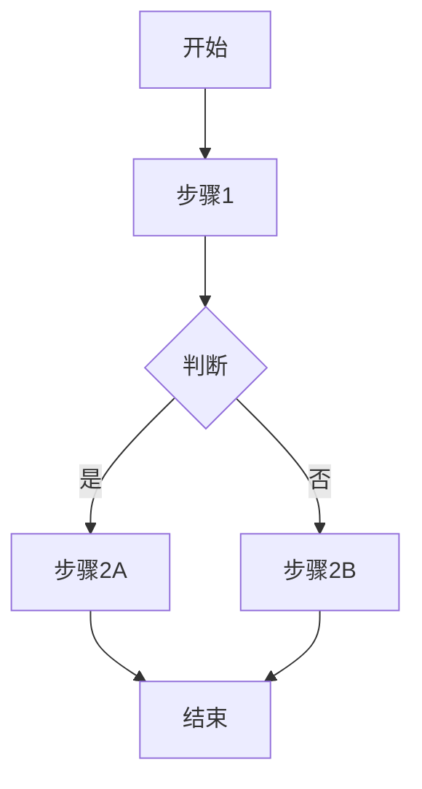

# [产品名称]产品详细设计文档

## 文档元数据

| 项目 | 内容 |
|------|------|
| **产品名称** | [产品名称] |
| **文档版本** | V1.0 |
| **创建日期** | 202X年X月X日 |
| **最后更新** | 202X年X月X日 |
| **产品经理** | [姓名] |
| **所属部门** | [部门] |
| **文档状态** | [草稿/评审中/已批准] |

---

## 修订历史

| 版本 | 日期 | 修订人 | 修订说明 |
|------|------|--------|----------|
| V1.0 | 202X年X月X日 | [姓名] | 初始版本 |

---

## 目录

- [一、产品概述](#一产品概述)
  - [（一）产品背景](#一产品背景)
  - [（二）产品定位](#二产品定位)
  - [（三）产品目标](#三产品目标)
  - [（四）目标用户](#四目标用户)
- [二、市场分析](#二市场分析)
  - [（一）市场规模](#一市场规模)
  - [（二）竞品分析](#二竞品分析)
  - [（三）竞争优势](#三竞争优势)
- [三、用户分析](#三用户分析)
  - [（一）用户画像](#一用户画像)
  - [（二）用户需求](#二用户需求)
  - [（三）用户场景](#三用户场景)
  - [（四）用户旅程](#四用户旅程)
- [四、产品功能](#四产品功能)
  - [（一）核心功能](#一核心功能)
  - [（二）辅助功能](#二辅助功能)
  - [（三）功能优先级](#三功能优先级)
- [五、功能详细设计](#五功能详细设计)
  - [（一）功能模块设计](#一功能模块设计)
  - [（二）用户流程设计](#二用户流程设计)
  - [（三）页面原型设计](#三页面原型设计)
  - [（四）交互说明](#四交互说明)
- [六、数据指标](#六数据指标)
  - [（一）核心指标](#一核心指标)
  - [（二）数据埋点](#二数据埋点)
  - [（三）数据分析](#三数据分析)
- [七、运营规划](#七运营规划)
  - [（一）推广策略](#一推广策略)
  - [（二）运营活动](#二运营活动)
  - [（三）用户增长](#三用户增长)
- [八、风险与应对](#八风险与应对)
  - [（一）产品风险](#一产品风险)
  - [（二）市场风险](#二市场风险)
  - [（三）应对措施](#三应对措施)
- [九、产品路线图](#九产品路线图)
  - [（一）版本规划](#一版本规划)
  - [（二）迭代计划](#二迭代计划)
  - [（三）里程碑](#三里程碑)

---

<div style="page-break-after: always;"></div>

# 一、产品概述

## （一）产品背景

　　说明产品的由来和业务背景，包括为什么要做这个产品，解决了什么问题，市场机会在哪里等内容。

### 1. 行业背景

　　描述行业现状、发展趋势、市场容量等宏观环境信息。

### 2. 业务背景

　　说明公司业务现状、为什么要开展这个产品、产品在公司战略中的位置等。

### 3. 问题定义

　　明确产品要解决的核心问题是什么，用户的痛点在哪里。

## （二）产品定位

　　明确产品在市场中的定位，包括产品类型、目标市场、差异化价值等。

### 1. 产品类型

　　说明是工具型、平台型、内容型还是社交型产品等。

### 2. 目标市场

　　明确产品的目标市场细分，包括地域、行业、用户群体等。

### 3. 价值主张

　　一句话概括产品为用户创造的核心价值。

## （三）产品目标

### 1. 商业目标

　　产品的商业目标，如营收、利润、市场份额等。

### 2. 用户目标

　　产品要为用户达成什么目标，解决什么问题。

### 3. 战略目标

　　产品在公司整体战略中的作用和价值。

## （四）目标用户

### 1. 用户群体

　　描述产品的主要用户群体有哪些。

### 2. 使用场景

　　用户在什么情况下会使用这个产品。

### 3. 价值预期

　　用户使用产品后期望获得什么价值。

<div style="page-break-after: always;"></div>

# 二、市场分析

## （一）市场规模

### 1. 市场容量

　　分析目标市场的总体规模、增长趋势等。

### 2. 市场细分

　　将市场划分为不同的细分领域，分析每个细分领域的情况。

### 3. 市场机会

　　识别市场中的机会点和空白点。

## （二）竞品分析

### 1. 主要竞品

　　列出主要的竞争对手产品，进行对比分析。

| 竞品名称 | 核心功能 | 目标用户 | 优势 | 劣势 |
|---------|---------|---------|------|------|
| 竞品A | [功能] | [用户] | [优势] | [劣势] |
| 竞品B | [功能] | [用户] | [优势] | [劣势] |

### 2. 竞品对比

　　从功能、体验、价格、服务等多个维度进行对比分析。

### 3. 竞品趋势

　　分析竞品的发展趋势和最新动向。

## （三）竞争优势

### 1. 差异化优势

　　我们的产品相比竞品的独特优势是什么。

### 2. 资源优势

　　我们有哪些资源可以支持产品成功。

### 3. 竞争策略

　　如何利用优势在竞争中取得胜利。

<div style="page-break-after: always;"></div>

# 三、用户分析

## （一）用户画像

### 1. 用户分类

　　根据用户特征将用户分为不同的类型。

| 用户类型 | 占比 | 特征描述 |
|---------|------|----------|
| 核心用户 | XX% | [描述] |
| 普通用户 | XX% | [描述] |
| 潜在用户 | XX% | [描述] |

### 2. 典型用户画像

　　详细描述2-3个典型用户画像。

**用户画像1：[角色名称]**

- 基本信息：年龄、性别、职业、收入等
- 行为特征：使用习惯、偏好、痛点等
- 需求描述：核心需求和期望
- 使用场景：典型使用场景描述

### 3. 用户特征

　　总结目标用户的共同特征和差异化特征。

## （二）用户需求

### 1. 需求收集

　　说明通过什么方式收集用户需求（访谈、问卷、数据分析等）。

### 2. 需求分类

　　将用户需求分为不同类别和优先级。

| 需求类别 | 具体需求 | 优先级 | 频次 |
|---------|---------|--------|------|
| 核心需求 | [描述] | 高 | 每天 |
| 期望需求 | [描述] | 中 | 每周 |
| 兴奋需求 | [描述] | 低 | 偶尔 |

### 3. 需求验证

　　说明如何验证这些需求的真实性和重要性。

## （三）用户场景

### 1. 使用场景列表

　　列出产品的主要使用场景。

### 2. 场景详细描述

**场景1：[场景名称]**

- 触发条件：什么情况下发生
- 用户目标：用户想达到什么目的
- 操作流程：用户如何操作
- 预期结果：用户期望的结果

### 3. 场景优先级

　　根据场景的重要性和发生频率确定优先级。

## （四）用户旅程

### 1. 用户生命周期

　　描述用户从接触到流失的完整生命周期。

### 2. 关键触点

　　列出用户在各个阶段的关键接触点。

### 3. 痛点分析

　　分析用户旅程中的痛点和机会点。

<div style="page-break-after: always;"></div>

# 四、产品功能

## （一）核心功能

### 1. 功能列表

　　列出产品的核心功能模块。

| 功能模块 | 功能描述 | 用户价值 | 优先级 |
|---------|---------|---------|--------|
| 功能A | [描述] | [价值] | P0 |
| 功能B | [描述] | [价值] | P0 |

### 2. 功能说明

**功能A：[功能名称]**

- 功能定义：这个功能是什么
- 用户价值：为用户带来什么价值
- 使用场景：什么情况下使用
- 基本流程：如何使用这个功能

### 3. 功能依赖关系

　　说明各功能之间的依赖关系。

## （二）辅助功能

### 1. 设置类功能

　　用户设置、账户管理等功能。

### 2. 支持类功能

　　帮助、反馈、客服等功能。

### 3. 增值功能

　　提升用户体验的辅助功能。

## （三）功能优先级

### 1. 优先级划分

| 优先级 | 功能列表 | 上线版本 |
|--------|---------|----------|
| P0（必须有） | [功能] | V1.0 |
| P1（应该有） | [功能] | V1.1 |
| P2（可以有） | [功能] | V2.0 |

### 2. MVP定义

　　明确MVP（最小可行产品）包含哪些功能。

### 3. 功能迭代规划

　　规划功能迭代的顺序和时间。

<div style="page-break-after: always;"></div>

# 五、功能详细设计

## （一）功能模块设计

### 1. 信息架构

　　描述产品的信息架构和导航结构。

```
产品首页
├── 模块A
│   ├── 功能A1
│   └── 功能A2
├── 模块B
│   ├── 功能B1
│   └── 功能B2
└── 个人中心
    ├── 设置
    └── 帮助
```

### 2. 功能详情

**模块A：[模块名称]**

（1）功能概述

　　简要说明这个模块的作用和价值。

（2）功能列表

| 功能点 | 说明 | 必需/可选 |
|--------|------|-----------|
| 功能1 | [说明] | 必需 |
| 功能2 | [说明] | 可选 |

（3）页面元素

| 元素 | 类型 | 说明 | 示例 |
|------|------|------|------|
| 标题 | 文本 | [说明] | [示例] |
| 按钮 | 交互 | [说明] | [示例] |

（4）业务规则

　　说明该模块的业务规则和约束条件。

## （二）用户流程设计

### 1. 核心流程

**流程1：[流程名称]**

　　描述用户完成某个目标的核心操作流程。



### 2. 异常流程

　　说明各种异常情况的处理方式。

### 3. 流程优化

　　说明如何优化流程以提升用户体验。

## （三）页面原型设计

### 1. 页面结构

**页面1：[页面名称]**

（1）页面布局

　　描述页面的整体布局结构。

（2）页面元素

| 区域 | 元素 | 说明 |
|------|------|------|
| 顶部 | 导航栏 | [说明] |
| 中部 | 内容区 | [说明] |
| 底部 | 操作区 | [说明] |

（3）页面说明

　　详细说明页面各个区域的作用和交互方式。

### 2. 页面流转

　　说明页面之间的跳转关系。

### 3. 状态设计

　　说明各种页面状态（空状态、加载状态、错误状态等）的设计。

## （四）交互说明

### 1. 交互规范

　　说明产品的基本交互规范。

### 2. 手势操作

　　如果支持手势操作，说明各种手势的含义。

### 3. 反馈机制

　　说明各种操作的反馈方式（加载提示、成功提示、错误提示等）。

### 4. 异常处理

　　说明各种异常情况的处理方式。

<div style="page-break-after: always;"></div>

# 六、数据指标

## （一）核心指标

### 1. 用户指标

| 指标名称 | 定义 | 目标值 | 统计周期 |
|---------|------|--------|----------|
| DAU | 日活跃用户数 | XX万 | 每日 |
| MAU | 月活跃用户数 | XX万 | 每月 |
| 新增用户 | 每日新增用户数 | XX | 每日 |

### 2. 业务指标

| 指标名称 | 定义 | 目标值 | 统计周期 |
|---------|------|--------|----------|
| 转化率 | [定义] | XX% | 每周 |
| 留存率 | [定义] | XX% | 每月 |
| 客单价 | [定义] | XX元 | 每月 |

### 3. 产品指标

| 指标名称 | 定义 | 目标值 | 统计周期 |
|---------|------|--------|----------|
| 功能使用率 | [定义] | XX% | 每周 |
| 用户满意度 | [定义] | XX分 | 每季度 |

## （二）数据埋点

### 1. 埋点规划

| 事件名称 | 事件属性 | 触发时机 | 优先级 |
|---------|---------|----------|--------|
| 事件1 | [属性] | [时机] | P0 |
| 事件2 | [属性] | [时机] | P1 |

### 2. 页面埋点

　　列出需要统计的页面和关键操作。

### 3. 数据采集

　　说明数据采集的方式和工具。

## （三）数据分析

### 1. 分析框架

　　说明如何进行数据分析。

### 2. 分析报告

　　说明数据分析报告的输出频率和方式。

### 3. 数据驱动

　　说明如何用数据驱动产品迭代。

<div style="page-break-after: always;"></div>

# 七、运营规划

## （一）推广策略

### 1. 渠道策略

| 推广渠道 | 目标用户 | 推广方式 | 预算 |
|---------|---------|----------|------|
| 渠道A | [用户] | [方式] | [金额] |
| 渠道B | [用户] | [方式] | [金额] |

### 2. 内容策略

　　说明内容营销的策略和规划。

### 3. 合作策略

　　说明可能的合作机会和方式。

## （二）运营活动

### 1. 活动规划

| 活动名称 | 活动目标 | 活动时间 | 负责人 |
|---------|---------|----------|--------|
| 活动1 | [目标] | [时间] | [姓名] |
| 活动2 | [目标] | [时间] | [姓名] |

### 2. 用户激励

　　说明如何激励用户参与和留存。

### 3. 社群运营

　　说明社群运营的策略和方式。

## （三）用户增长

### 1. 增长策略

　　说明如何实现用户增长（AARRR模型等）。

### 2. 病毒传播

　　说明如何设计病毒传播机制。

### 3. 用户留存

　　说明如何提升用户留存率。

<div style="page-break-after: always;"></div>

# 八、风险与应对

## （一）产品风险

### 1. 需求风险

| 风险 | 可能性 | 影响 | 应对措施 |
|------|--------|------|----------|
| 需求变更 | 高 | 高 | [措施] |
| 需求理解偏差 | 中 | 高 | [措施] |

### 2. 用户体验风险

| 风险 | 可能性 | 影响 | 应对措施 |
|------|--------|------|----------|
| 学习成本高 | 中 | 中 | [措施] |
| 功能复杂 | 中 | 中 | [措施] |

### 3. 竞争风险

| 风险 | 可能性 | 影响 | 应对措施 |
|------|--------|------|----------|
| 竞品抄袭 | 高 | 中 | [措施] |
| 竞品降价 | 中 | 中 | [措施] |

## （二）市场风险

### 1. 政策风险

　　说明可能的政策变化及应对。

### 2. 技术风险

　　说明技术相关的风险（从产品角度）。

### 3. 市场接受度

　　说明市场接受度的风险评估。

## （三）应对措施

### 1. 预防措施

　　说明如何预防各种风险。

### 2. 应急预案

　　说明各种风险发生时的应急处理方案。

### 3. 持续监控

　　说明如何持续监控风险。

<div style="page-break-after: always;"></div>

# 九、产品路线图

## （一）版本规划

### 1. 版本列表

| 版本 | 上线时间 | 核心功能 | 目标 |
|------|---------|----------|------|
| V1.0 | [日期] | [功能] | [目标] |
| V1.1 | [日期] | [功能] | [目标] |
| V2.0 | [日期] | [功能] | [目标] |

### 2. 功能演进

　　说明产品功能的演进路径。

### 3. 优先级调整

　　说明如何根据实际情况调整优先级。

## （二）迭代计划

### 1. 迭代节奏

　　说明产品迭代的周期和节奏（如每2周一个迭代）。

### 2. 短期规划（1-3个月）

| 迭代 | 时间 | 功能 | 负责人 |
|------|------|------|--------|
| 迭代1 | [时间] | [功能] | [姓名] |

### 3. 中期规划（3-6个月）

　　列出中期的主要目标和功能。

### 4. 长期愿景（6个月以上）

　　描述产品的长期愿景和方向。

## （三）里程碑

### 1. 关键节点

| 节点 | 时间 | 标志性事件 | 成功标准 |
|------|------|-----------|----------|
| 里程碑1 | [时间] | [事件] | [标准] |
| 里程碑2 | [时间] | [事件] | [标准] |

### 2. 验收标准

　　说明各里程碑的验收标准。

### 3. 庆祝与复盘

　　说明里程碑达成后的庆祝和复盘机制。

<div style="page-break-after: always;"></div>

---

## 附录

### 附录A：专业术语

| 术语 | 解释 |
|------|------|
| DAU | Daily Active User，日活跃用户数 |
| MAU | Monthly Active User，月活跃用户数 |
| MVP | Minimum Viable Product，最小可行产品 |

### 附录B：参考资料

| 序号 | 资料名称 | 来源 |
|------|---------|------|
| 1 | [资料名称] | [来源] |

### 附录C：相关文档

- [需求文档]（链接）
- [用户研究报告]（链接）
- [竞品分析报告]（链接）

---

**文档结束**

**编制人：** [姓名]
**审核人：** [姓名]
**批准人：** [姓名]
**日期：** 202X年X月X日

---

## 格式说明

本文档遵循以下格式规范：

**页面设置：**
- 纸张：A4
- 页边距：左右3.18cm，上下2.54cm

**字体要求：**
- 正文：宋体，小四号（12pt）
- 一级标题：二号，黑体
- 二级标题：小二，黑体
- 三级标题：三号，黑体

**段落格式：**
- 行距：1.5倍行距
- 首行缩进：2字符

**标题层级：**
- 一级标题：一、二、三、
- 二级标题：（一）（二）（三）
- 三级标题：1. 2. 3.
- 四级标题：（1）（2）（3）
- 五级标题：① ② ③
